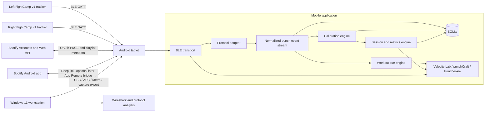
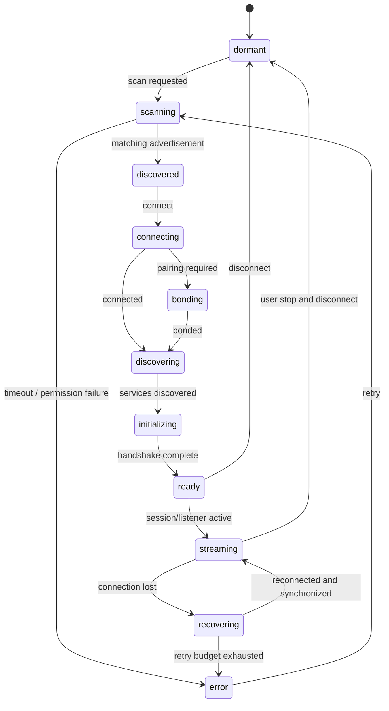
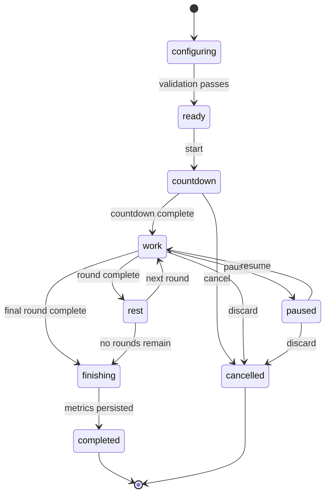

# punchCraft — Product and Engineering Design Specification

> Canonical design specification for punchCraft / Velocity Lab / Puncheokie. Platform facts were checked on 2026-08-22 (see §29). This document is the source of truth for the roadmap in [roadmap.md](roadmap.md) and the backlog in [`tools/backlog/backlog-issues.json`](../tools/backlog/backlog-issues.json) (labels, milestones, and the project definition live in [`backlog-static.json`](../tools/backlog/backlog-static.json)). Puncheokie's workout engine and live UX are specified in [puncheokie-ux-workout-engine.md](puncheokie-ux-workout-engine.md), which supersedes parts of §13, §17.1, §22 Phase 5, and §27 — see the §13 banner and §32.

## 1. Executive summary

punchCraft is an Android-first mobile application that restores useful life to a pair of unsupported FightCamp first-generation Bluetooth punch trackers. The application will connect to the left- and right-hand trackers, receive their Bluetooth Low Energy data, preserve raw device frames, decode punch events, calculate session metrics, and support three distinct training workflows:

- **Velocity Lab** — device connection, protocol diagnostics, live Bluetooth listening, calibration, and data export.
- **punchCraft** — configurable timed or free-form bag sessions with left/right punch counts, tracker-reported velocity, round metrics, and session history.
- **Puncheokie** — programmable punch-sequence workouts using numbered boxing combinations, regular or switch stance, and an optional user-connected Spotify playlist for background listening.

The first engineering milestone is not a polished workout interface. It is a reliable Bluetooth listener inside Velocity Lab that can:

- discover one tracker;
- connect and enumerate its GATT services and characteristics;
- subscribe to notifications or indications;
- record every incoming frame with timestamps and device identity;
- export the capture for analysis;
- repeat the process for two trackers concurrently; and
- produce at least one repeatable frame associated with a known punch.

The application will be local-first. Punch events, calibration profiles, workouts, and diagnostic captures will be stored on the tablet in SQLite. Spotify credentials will be stored separately in encrypted device storage. A cloud backend is not required for the initial product.

Because the tracker protocol is proprietary and currently undocumented, the application must be built around a protocol adapter and a capability model. The rest of the product must not depend on unverified assumptions such as a particular packet layout, physical velocity unit, punch-type taxonomy, or offline synchronization command.

## 2. Product purpose

### 2.1 Problem statement

The user owns functional first-generation FightCamp punch trackers, but the original vendor has announced that the device will no longer be supported. The hardware is still potentially useful, but its practical value depends on an application capable of connecting to it, receiving its data, and presenting meaningful training feedback.

The app should solve four related problems:

- **Hardware continuity:** keep the existing trackers usable without depending on the discontinued vendor experience.
- **Measurement transparency:** expose raw and interpreted tracker data so that velocity and count behavior can be inspected rather than treated as an opaque score.
- **Flexible training:** allow simple timer-based bag work without requiring a subscription or prescribed video workout.
- **Programmed practice:** provide configurable numbered punch sequences that can be followed while the athlete listens to a selected personal playlist.

### 2.2 Product vision

The product should function as an instrument first and a training interface second. The underlying Bluetooth data path must be observable, replayable, and calibratable. Once that foundation is stable, the same normalized punch-event stream should power every training mode.

### 2.3 Primary user

The initial user is a technically capable owner of FightCamp v1 trackers who:

- can install Android development builds;
- is comfortable pairing Bluetooth devices;
- wants to inspect and calibrate tracker behavior;
- wants independent bag-session timers and metrics; and
- may connect a personal Spotify account for playlist selection.

The initial design does not require multi-tenant accounts, subscriptions, social features, or coach administration.

## 3. Goals, non-goals, and success criteria

### 3.1 Product goals

The first product version shall:

- connect to both first-generation trackers from a physical Android tablet;
- preserve raw Bluetooth observations before applying protocol assumptions;
- identify each tracker as left or right;
- decode punch events to the fullest extent supported by the discovered protocol;
- distinguish confirmed physical units from raw or normalized tracker units;
- support user-specific and hand-specific calibration profiles;
- run configurable work/rest timers;
- persist sessions and per-punch events locally;
- calculate stable, reproducible metrics from the stored event stream;
- execute programmed numbered combinations in regular and switch stances;
- optionally retrieve a user's Spotify playlists through OAuth; and
- continue to run punchCraft and non-Spotify Puncheokie workouts without internet access.

### 3.2 Engineering goals

The implementation shall:

- isolate BLE transport from tracker-specific protocol decoding;
- isolate domain logic from React components;
- allow captured BLE frames to be replayed through new decoder versions;
- keep two tracker connections independent so one disconnect does not corrupt the other;
- use monotonic timestamps for ordering and elapsed-time calculations;
- use wall-clock timestamps only for display, history, and exports;
- keep raw values alongside calibrated/display values;
- version all protocol decoders and calibration profiles; and
- use deterministic session aggregation so a stored session can be recalculated after a decoder change.

### 3.3 Initial success criteria

The initial technical proof is successful when all of the following are true:

1. The Android development build scans for and discovers a tracker.
2. The app connects without the official FightCamp application running.
3. The app discovers and displays the tracker's GATT services and characteristics.
4. The app subscribes to all relevant notify/indicate characteristics.
5. A known punch produces a repeatable captured frame or sequence of frames.
6. The app can perform the same operation with both trackers.
7. Captures can be exported as JSON and analyzed on the Windows PC.
8. The app can disconnect, reconnect, and resume listening without restarting the process.

### 3.4 Non-goals for the first release

The first release will not attempt to:

- modify tracker firmware;
- extract or redistribute proprietary firmware images;
- claim laboratory-grade punch speed, force, energy, or power;
- infer head-impact risk or provide medical advice;
- support kicks;
- train an ML model on Spotify content;
- download, cache, remix, analyze, or rebroadcast Spotify audio;
- provide beat-synchronized visual choreography without separate policy review;
- provide public leaderboards or social networking;
- require a cloud account; or
- support iOS before the Android implementation is reliable.

## 4. Known hardware facts and unresolved capabilities

### 4.1 Known operational facts

The first-generation system uses two separately paired Bluetooth trackers. FightCamp's legacy instructions describe accepting two pairing prompts, and Hykso documentation identifies blue as the left-hand tracker and red as the right-hand tracker. Hykso also states that pending punch data can remain temporarily on the trackers and be uploaded after reconnection. These behaviors imply that the protocol may include tracker identity, event sequence information, and an offline synchronization mechanism. See references R1–R4.

The tracker vendor has historically described the devices as detecting punch count, type, and velocity. That does not establish which fields are exposed over BLE, which values are calculated on-device, or whether raw IMU samples are available to a third-party client.

### 4.2 Capability ladder

The app must discover and record support for each capability rather than hard-code an all-or-nothing assumption.

| Capability | Minimum product behavior when available | Fallback when unavailable |
|---|---|---|
| Left/right device identity | Assign each event to a hand automatically | User manually assigns devices in Velocity Lab |
| Real-time punch event | Update live count and metrics | Use synchronized/batch events after reconnect if available |
| Event sequence number | Deduplicate and detect gaps | Deduplicate by payload hash and timestamp heuristics |
| Tracker timestamp | Preserve tracker-time ordering | Use app receive timestamp |
| Velocity value | Calculate per-hand velocity metrics | Count-only operation |
| Physical velocity unit | Display confirmed unit | Display "tracker units" or normalized velocity index |
| Punch type | Match numbered technique classes | Match only hand order and punch count |
| Battery state | Show battery indicators | Show connection status only |
| Offline event sync | Recover punches after temporary disconnect | Mark the disconnect interval as incomplete |
| Raw IMU samples | Advanced research and custom algorithms | Use tracker-processed events only |

### 4.3 Terminology rule

Until validated against an external reference, the product shall use the term **tracker-reported velocity**. It shall not label the value "impact speed," "force," "power," or "energy."

## 5. System context



### 5.1 Device roles

- The FightCamp trackers are BLE peripherals and GATT servers.
- The Android tablet is the BLE central and GATT client.
- The Windows PC is the development and analysis host.
- The PC and tablet must not attempt to connect to the same tracker simultaneously during normal testing unless multi-central support has been proven.

## 6. Application navigation

The app will expose three primary bottom tabs:

1. Velocity Lab
2. punchCraft
3. Puncheokie

Settings, history, data export, and developer diagnostics should be presented as nested screens or a top-level menu rather than adding more permanent tabs during the first release.

A proposed Expo Router structure is:

```text
src/app/
  _layout.tsx
  (tabs)/
    _layout.tsx
    velocity-lab/
      index.tsx
      devices.tsx
      listener.tsx
      calibration.tsx
      captures.tsx
    punchcraft/
      index.tsx
      configure.tsx
      live.tsx
      summary.tsx
      history.tsx
    puncheokie/
      index.tsx
      presets.tsx
      recipe.tsx
      spotify.tsx
      live.tsx
      summary.tsx
  settings/
    index.tsx
    diagnostics.tsx
    data-management.tsx
```

Expo Router supports a bottom-tab layout and nested stacks; the domain services described below must remain outside route components. See reference R5.

## 7. Velocity Lab functional design

Velocity Lab is the engineering and calibration surface. It is a first-class product feature, not a hidden debug menu.

### 7.1 Velocity Lab responsibilities

Velocity Lab shall provide:

- Bluetooth permission onboarding;
- tracker scanning and identification;
- connection, bonding, and disconnection controls;
- a two-device connection dashboard;
- GATT service and characteristic inventory;
- notification/indication subscriptions;
- a live raw-frame listener;
- parsed punch-event display;
- hand assignment;
- connection-health metrics;
- calibration workflows;
- capture export and replay selection; and
- protocol diagnostics that can be hidden in a simplified user mode later.

### 7.2 Velocity Lab screen hierarchy

#### A. Device dashboard

Display one card per expected tracker with:

- logical hand assignment;
- tracker LED color if known;
- advertisement name;
- Android device identifier;
- signal strength;
- connection state;
- bond state if available;
- firmware/hardware revision if readable;
- battery value if readable;
- last event time;
- event count for the current listener run; and
- reconnect button.

Primary actions:

- Scan
- Connect left
- Connect right
- Connect both
- Disconnect
- Open listener

#### B. Listener workspace

The listener view shall show:

- elapsed listener time;
- per-hand event counters;
- latest parsed event;
- latest raw payload in hexadecimal;
- service and characteristic UUID;
- receive timestamp;
- notification rate;
- duplicate count;
- sequence-gap count;
- error count;
- dropped-frame warning; and
- capture recording status.

Diagnostic controls:

- start/stop capture;
- clear in-memory display without deleting stored capture;
- filter by tracker, UUID, direction, or decode result;
- mark an observation with a label such as `one-left-jab`;
- export capture;
- copy a payload;
- replay a stored capture through the active decoder; and
- enable guarded write controls only in developer mode.

#### C. GATT inspector

For each service and characteristic, show:

- UUID;
- readable name if standard;
- properties: read, write, write-without-response, notify, indicate;
- descriptors;
- current value if safely readable;
- whether the official-app capture used it; and
- protocol hypothesis notes.

Unknown characteristics shall never receive arbitrary writes. Write actions must require a known command template or an explicit developer-mode confirmation.

#### D. Calibration workspace

Calibration is described in detail in Section 10. The UI shall support:

- choosing a tracker/hand;
- choosing a calibration mode;
- guided punch sets;
- accepting/rejecting individual samples;
- visualizing distributions;
- comparing left and right profiles;
- saving a versioned profile;
- activating or reverting a profile; and
- testing the profile in a short live run.

### 7.3 Velocity Lab acceptance criteria

Velocity Lab is complete for the first milestone when:

- it connects to one tracker and logs a repeatable notification;
- it connects to both trackers in the same app process;
- all frames are persisted before parsing;
- a parse failure never discards the original payload;
- the user can label a capture while performing a controlled test;
- JSON export includes timestamps, device identity, UUIDs, direction, raw data, and parsed data;
- disconnecting either tracker does not terminate the other connection; and
- the app can restore a ready state after a normal disconnect/reconnect cycle.

## 8. punchCraft functional design

punchCraft is the general-purpose bag-session mode. It consumes the same normalized events produced by Velocity Lab but hides protocol details.

### 8.1 Session types

punchCraft shall support:

- **Free session:** count-up timer until the user stops.
- **Single timer:** one configurable work interval.
- **Round workout:** preparation countdown, repeated work/rest intervals, and optional final cooldown.
- **Open rounds:** user advances between work and rest manually.

Initial timer fields:

| Field | Initial range/default |
|---|---|
| Preparation countdown | 0–60 seconds; default 10 seconds |
| Number of rounds | 1–20; default 3 |
| Work duration | 15 seconds–5 minutes; default 3 minutes |
| Rest duration | 0–5 minutes; default 1 minute |
| Final countdown cue | Configurable; default final 10 seconds |
| Auto-start on first punch | Optional, off by default |
| Require both trackers | Configurable; on by default |

### 8.2 Pre-session readiness gate

Before starting, punchCraft shall display:

- left tracker readiness;
- right tracker readiness;
- active calibration profile per hand;
- capability summary;
- battery value if available;
- Spotify status only when launched from Puncheokie; and
- an explicit warning if the session will run in degraded mode.

Examples of degraded modes:

- right tracker unavailable: left-hand-only session;
- velocity unavailable: count-only session;
- punch type unavailable: hand/count metrics only;
- offline recovery unavailable: punches during disconnect may be missing.

### 8.3 Live session UI

The default live view shall prioritize large, glanceable values:

- round number and timer;
- total punch count;
- left punch count;
- right punch count;
- average tracker-reported velocity;
- current or most recent punch velocity;
- connection indicators; and
- pause/stop controls.

The user may choose additional "pop-out" metric tiles. Candidate metrics are defined in Section 9.

### 8.4 Session controls

Required controls:

- start;
- pause;
- resume;
- skip rest;
- advance round when using open rounds;
- stop and save;
- stop and discard; and
- reconnect a tracker without discarding the session.

Pause semantics must be explicit:

- timer stops;
- punch events remain recorded but receive a `duringPause` quality flag;
- paused punches do not contribute to the default session metrics;
- the user may include them during post-session reprocessing if desired.

### 8.5 Session summary

The summary shall include:

- session duration;
- active work duration;
- total/left/right counts;
- left/right percentages;
- average, median, maximum, and 90th-percentile velocity when available;
- per-round counts and rates;
- per-round velocity statistics;
- connection interruptions;
- recovered event count;
- unmatched or malformed event count;
- active calibration profile/version; and
- notes entered by the user.

The summary must disclose the velocity representation:

- confirmed physical unit;
- tracker unit;
- calibrated tracker unit; or
- normalized velocity index.

### 8.6 History

History shall support:

- list by date;
- filter by session type;
- view session details;
- compare rounds;
- export CSV/JSON;
- recalculate metrics with a newer decoder or calibration profile without altering the original raw event data; and
- delete a session and its associated captures.

## 9. Metrics model

### 9.1 Confirmed metrics

These metrics can be computed from hand-tagged punch events without punch-type support:

| Metric | Definition |
|---|---|
| Total punches | Number of accepted punch events in active work intervals |
| Left punches | Accepted events assigned to the left tracker |
| Right punches | Accepted events assigned to the right tracker |
| Left/right share | Hand count divided by total count |
| Punch rate | Accepted punches / active work minutes |
| Inter-punch interval | Time between consecutive accepted events |
| Combination burst length | Consecutive events separated by less than a configurable burst threshold |
| Connection completeness | Percentage of active time with expected trackers ready |
| Recovered punches | Events received through an offline synchronization path, if identified |

### 9.2 Velocity-dependent metrics

When a velocity-like field is available:

- average velocity overall and by hand;
- median velocity overall and by hand;
- maximum velocity;
- 90th-percentile velocity;
- fast-punch percentage relative to a calibration zone;
- velocity consistency, based on robust dispersion;
- velocity drop-off from the first third to final third of a round;
- highest-output interval; and
- left/right velocity asymmetry.

Averages shall exclude events marked malformed, duplicate, clipped, outside the active interval, or rejected by the user. The count of excluded events must remain visible in diagnostics.

### 9.3 Optional metrics when punch type is decoded

- count by punch type;
- average velocity by punch type;
- straight-versus-power balance;
- combination recognition;
- expected-versus-observed technique category in Puncheokie; and
- technique-specific fatigue trends.

### 9.4 Custom output index

A future punchCraft Output Index may combine punch volume and normalized velocity, but it must be explicitly described as a dimensionless product metric. It must not be presented as joules, watts, force, or transferred energy.

A provisional calculation can be evaluated after calibration data exists:

```text
normalizedVelocity = clamp((calibratedVelocity - lowerReference) /
                           (upperReference - lowerReference), 0, 1.25)
punchContribution = normalizedVelocity ^ 2
roundOutputIndex = sum(punchContribution for accepted punches)
```

This formula is a design hypothesis, not an MVP requirement. It should not be activated until sample sessions demonstrate that it behaves predictably.

### 9.5 Quality metrics

Developer and Velocity Lab views should expose:

- BLE notification latency;
- frame rate;
- duplicate frame count;
- parser failure rate;
- sequence gaps;
- tracker reconnect count;
- offline-recovered event count;
- unknown message-type count; and
- database write backlog.

## 10. Calibration design

Calibration has several meanings in this project and must not be reduced to one "calibrate" button.

### 10.1 Calibration layers

#### Layer 1: Protocol scaling calibration

Purpose: determine how raw packet fields map to numeric values and units.

Examples:

- little-endian versus big-endian integer;
- signed versus unsigned;
- fixed-point divisor;
- centimeters per second versus another unit;
- whether the value is instantaneous, maximum during the punch, or a proprietary score.

This layer is decoder-specific and normally performed during protocol research.

#### Layer 2: Device and hand calibration

Purpose: account for differences between the physical left and right tracker and establish hand assignment.

Stored values may include:

- device identity fingerprint;
- logical hand;
- raw scale and offset;
- expected idle behavior;
- valid raw range;
- outlier bounds; and
- preferred placement/orientation notes.

#### Layer 3: Athlete relative-velocity calibration

Purpose: create useful personal zones even when an absolute physical unit is not confirmed.

Suggested guided procedure for each hand:

1. Confirm tracker placement and hand assignment.
2. Record 10 seconds of no intentional punches.
3. Throw 10 controlled low-intensity straight punches with clear separation.
4. Throw 10 normal training-speed straight punches.
5. Throw 10 fast but technically controlled straight punches.
6. Optionally repeat for hooks and uppercuts if punch type is available.
7. Review rejected samples and obvious false positives.
8. Calculate robust percentiles and save a versioned profile.
9. Run a 30-second live validation round.

Default relative zones can be derived from the accepted distribution:

- Zone 1 — controlled: at or below the calibration 35th percentile;
- Zone 2 — working: above P35 through P70;
- Zone 3 — fast: above P70 through P90;
- Zone 4 — peak: above P90.

These percentiles are configurable. They describe the athlete's observed tracker distribution, not universal boxing standards.

#### Layer 4: Optional external absolute calibration

Purpose: estimate a physical speed mapping using an external reference such as high-frame-rate video.

The external procedure should capture paired observations:

```text
tracker raw value -> independently estimated hand speed
```

A simple model may start as:

```text
physicalSpeed = rawValue * scale + offset
```

A model must be evaluated separately by hand and punch type. The app shall retain the reference method, sample count, error estimate, and date. It shall not show an absolute unit without a saved validation record.

### 10.2 Calibration profile model

```ts
export interface CalibrationProfile {
  id: string;
  version: number;
  deviceId: string;
  hand: 'left' | 'right';
  decoderVersion: string;
  method: 'raw-map' | 'relative-zones' | 'external-reference';
  sourceUnit: 'unknown' | 'tracker-unit' | 'cm/s' | 'm/s' | 'mph';
  displayUnit: 'tracker-unit' | 'index' | 'cm/s' | 'm/s' | 'mph';
  scale: number;
  offset: number;
  lowerValid?: number;
  upperValid?: number;
  p10?: number;
  p35?: number;
  p50?: number;
  p70?: number;
  p90?: number;
  externalReferenceMethod?: string;
  estimatedError?: number;
  sampleCount: number;
  createdAt: string;
  active: boolean;
}
```

### 10.3 Calibration transformation

Every event must retain both values:

- `velocityRaw`
- `velocityCalibrated`

A generic transformation is:

```text
velocityCalibrated = max(0, velocityRaw * scale + offset)
```

A normalized personal index may be calculated as:

```text
velocityIndex = 100 * clamp(
  (velocityCalibrated - p10) / (p90 - p10),
  0,
  1.25
)
```

The app must guard against zero-width percentile ranges, missing samples, decoder changes, and stale profiles.

### 10.4 Calibration invalidation

A calibration profile should be marked stale when:

- the protocol decoder version changes incompatibly;
- a different physical tracker is assigned to the hand;
- the tracker firmware changes;
- the user changes tracker placement materially;
- the external-reference method changes; or
- the user explicitly resets the profile.

Stale profiles remain available for historical session reprocessing but cannot be applied silently to new sessions.

## 11. BLE subsystem design

### 11.1 Platform choice

Use the physical Android tablet as the BLE central. Use the Windows 11 PC for Metro, ADB, builds, capture analysis, and optional independent Bleak experiments.

The Android emulator is acceptable for screens and mocked sessions but shall not be the validation environment for physical tracker communication.

### 11.2 Expo build model

BLE requires native code. The project must use an Expo development build or locally prebuilt native project; it cannot rely on Expo Go. react-native-ble-plx documents an Expo config plugin and native build requirement. See reference R6.

Version policy:

- begin from a stable Expo SDK;
- run a minimal scan/connect spike on the target tablet;
- lock exact Expo, React Native, and BLE-library versions after the spike passes;
- do not upgrade the Expo SDK during protocol discovery without a separate compatibility branch; and
- preserve a known-good APK before dependency upgrades.

This is important because BLE library compatibility can lag new Expo/React Native releases.

### 11.3 Android permission policy

The native manifest and runtime permission flow shall support:

- Android 12/API 31 and newer: `BLUETOOTH_SCAN` and `BLUETOOTH_CONNECT`;
- older Android versions, if supported: the required location permission for BLE scanning;
- Bluetooth-disabled detection and a user-facing remediation screen; and
- denial, permanent denial, and settings-return flows.

The `neverForLocation` assertion shall only be enabled after testing confirms that it does not filter these trackers on the target OS/device. Android and the BLE library both warn that BLE scanning behavior and permissions vary by OS level. See references R7–R9.

### 11.4 Component boundaries

```text
BleManagerFacade
  ├── PermissionService
  ├── ScanService
  ├── TrackerConnection(left)
  ├── TrackerConnection(right)
  ├── GattOperationQueue
  ├── NotificationRouter
  └── BleCaptureSink
TrackerProtocolRegistry
  └── FightCampV1ProtocolAdapter
        ├── capability detection
        ├── initialization commands
        ├── frame decoding
        ├── event deduplication hints
        └── offline-sync commands, if discovered
```

React components shall never call react-native-ble-plx directly. They call application services or commands.

### 11.5 Connection state machine

Each physical tracker has an independent state machine:



The two-tracker coordinator exposes an aggregate state:

- `noneReady`
- `leftOnly`
- `rightOnly`
- `bothReady`
- `degradedDuringSession`

### 11.6 Scanning strategy

- Use bounded scans; default 10–15 seconds.
- Stop scanning once expected trackers are found unless the user chooses continued diagnostics.
- Filter by known service UUID, name, manufacturer data, or saved fingerprint only after those identifiers are confirmed.
- During protocol discovery, retain unfiltered scan metadata to avoid filtering out a tracker whose advertisement changes after wake-up or bonding.
- Never run an endless scan loop; Android notes that BLE scanning is battery intensive. See reference R10.

### 11.7 Device identity

Do not use only the displayed device name. Persist a device fingerprint containing as many stable attributes as available:

- Android device ID/address observed by the library;
- advertisement name;
- service UUID set;
- manufacturer-specific data;
- serial number characteristic if present;
- firmware/hardware revision;
- LED/hand assignment confirmed by the user; and
- protocol-adapter confidence.

The user must be able to reassign left/right manually.

### 11.8 GATT operation serialization

Many Android BLE stacks behave poorly when reads, writes, descriptor changes, and MTU requests overlap. All operations for one connection shall pass through a serialized queue with:

- operation ID;
- operation type;
- timeout;
- retry policy;
- expected callback;
- completion/error timestamp; and
- diagnostic logging.

Operations on different tracker connections may run independently.

### 11.9 Notification subscription

After service discovery:

1. identify all notify/indicate characteristics;
2. subscribe according to the known protocol profile;
3. during discovery mode, optionally subscribe to every safe notify/indicate characteristic;
4. record the subscription operation and result;
5. persist every incoming frame before parsing; and
6. route frames to the protocol adapter.

Android's BLE model uses a GATT client to discover services, read characteristics, and request notifications from the peripheral GATT server. See references R8 and R11.

### 11.10 Pairing and bonding

Potential outcomes:

- no bond required;
- Android automatically prompts when a protected operation is attempted; or
- explicit bond management is required.

If react-native-ble-plx cannot reliably initiate or inspect bonding for this tracker, add a small Android Expo native module exposing only:

- create bond;
- current bond state;
- bond-state event subscription; and
- optional remove bond in developer diagnostics.

Bond removal must be guarded because it can disrupt a known-good device configuration.

### 11.11 Foreground/background policy

MVP behavior is foreground-only during an active workout:

- keep the screen awake;
- warn before the app is backgrounded;
- preserve the session when possible;
- attempt reconnection on foreground return; and
- record the disconnect gap.

Background BLE on modern Android introduces foreground-service and lifecycle requirements. It should be a later feature after foreground reliability is established. See reference R12.

## 12. FightCamp v1 protocol discovery and adapter design

### 12.1 Safety and evidence rules

- Observe before writing.
- Preserve the official-app baseline while it can still connect.
- Never guess packet meaning from one sample.
- Change one physical variable at a time.
- Keep raw captures immutable.
- Record all hypotheses with confidence and evidence.
- Do not make application UI depend on a field until the decoder has repeatable tests.

### 12.2 Capture workflow

For each controlled test:

1. Fully charge both trackers.
2. Confirm tracker placement and left/right identity.
3. Start Android Bluetooth HCI snoop logging if the official app can still be exercised.
4. Screen-record the official app and visible time.
5. Run one precisely labeled scenario.
6. Export the snoop log to Windows.
7. Isolate ATT/GATT traffic in Wireshark.
8. Correlate GATT writes and notifications with the physical action.
9. Repeat the scenario at least three times.
10. Convert confirmed sequences into replay fixtures.

Controlled scenarios:

- connect only, no punches;
- start and stop an empty session;
- one left punch;
- one right punch;
- exactly five left punches with two-second gaps;
- exactly five alternating punches;
- slow/normal/fast punches of the same type;
- disconnect, throw known punches, reconnect;
- sleep and wake;
- tracker A only versus tracker B only.

### 12.3 Protocol adapter contract

```ts
export interface TrackerProtocolAdapter {
  readonly id: string;
  readonly version: string;
  scoreAdvertisement(ad: AdvertisementSnapshot): number;
  inspectGatt(gatt: GattSnapshot): ProtocolInspection;
  buildInitializationPlan(ctx: InitializationContext): GattOperation[];
  decodeFrame(frame: RawBleFrame, state: ProtocolState): DecodeResult;
  buildStartSession?(ctx: SessionCommandContext): GattOperation[];
  buildStopSession?(ctx: SessionCommandContext): GattOperation[];
  buildOfflineSync?(ctx: SyncContext): GattOperation[];
  buildSleepCommand?(ctx: CommandContext): GattOperation[];
}
```

The adapter may return:

- one punch event;
- multiple recovered punch events;
- device status;
- acknowledgment;
- clock/sync information;
- unknown frame; or
- malformed frame.

### 12.4 Raw frame contract

```ts
export interface RawBleFrame {
  id: string;
  captureId: string;
  deviceId: string;
  handAtCapture: 'left' | 'right' | 'unknown';
  monotonicTimeMs: number;
  wallTimeIso: string;
  direction: 'notification' | 'indication' | 'read' | 'write';
  serviceUuid: string;
  characteristicUuid: string;
  valueBase64: string;
  valueHex: string;
  rssi?: number;
  connectionGeneration: number;
}
```

### 12.5 Normalized punch event contract

```ts
export interface TrackerPunchEvent {
  id: string;
  sourceFrameId: string;
  deviceId: string;
  hand: 'left' | 'right' | 'unknown';
  trackerTimestampMs?: number;
  receivedMonotonicTimeMs: number;
  receivedWallTimeIso: string;
  sequence?: number;
  punchTypeRaw?: number;
  punchType?: 'straight' | 'hook' | 'uppercut' | 'power' | 'unknown';
  velocityRaw?: number;
  velocityCalibrated?: number;
  velocityUnit: 'unknown' | 'tracker-unit' | 'index' | 'cm/s' | 'm/s' | 'mph';
  recovered: boolean;
  decoderId: string;
  decoderVersion: string;
  qualityFlags: PunchQualityFlag[];
}
```

### 12.6 Deduplication and gap handling

Preferred deduplication uses a tracker sequence/event ID. Until one is confirmed, use a conservative compound key:

```text
device + connection generation + payload hash + short time bucket
```

Heuristic deduplication must never silently delete the raw frame. It marks the normalized event as a likely duplicate and excludes it from default metrics.

If a sequence number is decoded:

- detect forward gaps;
- distinguish wraparound from reset;
- record the last acknowledged/synchronized sequence per tracker;
- prevent offline-recovered events from being counted twice; and
- preserve out-of-order arrival while sorting event time deterministically.

### 12.7 Replay harness

Every confirmed capture should become a fixture containing:

- advertisement snapshot;
- GATT inventory;
- initialization operations;
- ordered frames;
- expected decoded messages; and
- test labels.

The replay harness must run without Bluetooth hardware. This allows protocol work on the Windows PC and prevents UI or dependency changes from silently breaking decoding.

## 13. Puncheokie functional design

> **Superseded in part (2026-08-23).** The Puncheokie workout model, recipe/generator/seed, cue lifecycle, cadence, live screen, Voice Coach, and persistence are specified in [puncheokie-ux-workout-engine.md](puncheokie-ux-workout-engine.md) (v0.2), whose "Status and supersession" table lists exactly which parts of §6, §13, §15.2, §16, §17.1, §18, §19.4, §22 Phase 5, and §27 it replaces. §13.1–13.6 remain as the original rationale and as the definition of the capability tiers and the **hand-sequence match** rule, which still apply. In particular: `PunchProgram`/`ProgramRound`/`PunchCue` (§13.4) are replaced by `WorkoutRecipe` → generated `WorkoutBlock[]`/`WorkoutToken[]`; stance values are `orthodox`/`southpaw`/`switch`, not `regular`/`switch`; defense/footwork/coach tokens are display-only and unscored.

Puncheokie is a programmed workout mode. The name is a play on "karaoke": the athlete follows displayed punch combinations while listening to personal music.

### 13.1 Core user flow

1. Open Puncheokie.
2. Choose or create a punch program.
3. Choose the athlete's default stance.
4. Optionally connect Spotify and select a playlist.
5. Confirm tracker readiness and calibration.
6. Open the playlist in Spotify or use an approved playback-control option.
7. Return to Puncheokie.
8. Start the workout countdown.
9. Follow visual and haptic punch cues.
10. Review completion, count, hand matching, velocity, and round metrics.

### 13.2 Punch numbering model

The application shall use lead/rear semantics internally and map them to physical hands based on stance.

Default six-punch mapping:

| Number | Technique role | Regular/default stance hand | Switch stance hand |
|---|---|---|---|
| 1 | Lead straight/jab | Left | Right |
| 2 | Rear straight/cross | Right | Left |
| 3 | Lead hook | Left | Right |
| 4 | Rear hook | Right | Left |
| 5 | Lead uppercut | Left | Right |
| 6 | Rear uppercut | Right | Left |

The user's "regular" stance may be configured as orthodox or southpaw. "Switch" always means the opposite lead/rear assignment.

### 13.3 Capability-aware scoring

Puncheokie must not claim technique recognition beyond the tracker data.

| Available event fields | Supported validation |
|---|---|
| Hand only | Expected hand order and count |
| Hand + timestamp | Hand order, count, and timing window |
| Hand + broad type | Broad technique-family match |
| Hand + distinct type | Full numbered technique match |
| Velocity | Optional intensity-zone target |

When only hand is known, an orthodox-stance 1-2-3 sequence maps to left-right-left (southpaw: right-left-right). The app may score that hand pattern but must label the result **hand-sequence match**, not punch-technique accuracy, on every surface that shows it — the live count badge, block and round readouts, and the session summary.

### 13.4 Program structure

A program contains rounds and timed cue segments. It is independent of a specific music track.

```ts
export interface PunchProgram {
  id: string;
  name: string;
  description?: string;
  version: number;
  defaultStance: 'regular' | 'switch';
  rounds: ProgramRound[];
  createdAt: string;
  updatedAt: string;
}

export interface ProgramRound {
  id: string;
  order: number;
  workDurationMs: number;
  restAfterMs: number;
  cues: PunchCue[];
}

export interface PunchCue {
  id: string;
  startOffsetMs: number;
  durationMs: number;
  stance: 'inherit' | 'regular' | 'switch';
  sequence: number[];
  repeat: number;
  targetVelocityZone?: 1 | 2 | 3 | 4;
  graceBeforeMs?: number;
  graceAfterMs?: number;
  instruction?: string;
}
```

Example program fragment:

```json
{
  "name": "Three-Round Fundamentals",
  "defaultStance": "regular",
  "rounds": [
    {
      "order": 1,
      "workDurationMs": 180000,
      "restAfterMs": 60000,
      "cues": [
        {
          "startOffsetMs": 0,
          "durationMs": 8000,
          "stance": "inherit",
          "sequence": [1, 2],
          "repeat": 3
        },
        {
          "startOffsetMs": 8000,
          "durationMs": 10000,
          "stance": "switch",
          "sequence": [1, 2, 3],
          "repeat": 2
        }
      ]
    }
  ]
}
```

### 13.5 Cue presentation

The live cue screen shall show:

- current stance;
- current numbered sequence in large type;
- lead/rear or left/right hand hints;
- repeat count;
- time remaining in the cue;
- next cue preview;
- round timer;
- actual punch count for the cue;
- sequence-match status; and
- optional velocity-zone status.

Use visual and haptic cues by default. The Voice Coach (spoken cues; [puncheokie-ux-workout-engine.md](puncheokie-ux-workout-engine.md)) is fully available when no third-party playback is active. While Spotify or any other third-party playback is active, the Voice Coach is gated behind an explicit user toggle that defaults to OFF and whose label states that it speaks over the user's music; the app never enables it automatically. This gate stays in place until the Spotify policy review in §22 Phase 7 task 10 is complete and, if necessary, written permission is obtained.

### 13.6 Event-to-cue matching

Each cue defines an acceptance window:

```text
windowStart = cueStart - graceBefore
windowEnd   = cueEnd + graceAfter
```

Matching requirements:

- one punch event may be assigned to at most one expected punch;
- events are matched in event-time order;
- recovered events may be assigned after reconnection if their tracker timestamp supports reliable ordering;
- hand mismatch and type mismatch are separate outcomes;
- extra punches remain visible and may reduce precision but never disappear; and
- cue results are recalculable when decoder capabilities improve.

Initial scoring dimensions:

- completion percentage;
- correct-hand percentage;
- timing-window percentage;
- technique-category percentage when supported;
- average velocity by cue;
- target-zone percentage; and
- extra-punch count.

## 14. Spotify integration design

### 14.1 Product interpretation of "sync playlist"

For this project, playlist sync means:

- authorize the user's Spotify account;
- retrieve playlist metadata the user is permitted to access;
- allow the user to select a playlist;
- preserve its Spotify ID/URI and snapshot metadata locally; and
- open or optionally control playback through supported Spotify mechanisms.

It does not mean downloading audio, extracting audio features without a permitted endpoint, analyzing beats, aligning cues to song structure, mixing app audio into the Spotify audio stream (the opt-in Voice Coach plays on a separate Android audio stream with transient audio focus and never alters Spotify's audio; §13.5), or copying Spotify content into the app.

### 14.2 Authentication

Use OAuth 2.0 Authorization Code with PKCE. Spotify recommends PKCE for mobile clients where a client secret cannot be safely stored. Expo AuthSession supports browser-based OAuth flows and custom app schemes in development/standalone builds. See references R13 and R14.

Store:

- access token;
- refresh token;
- token expiry;
- granted scopes; and
- Spotify account identifier

in `expo-secure-store`, not SQLite or AsyncStorage. Expo documents SecureStore for encrypted local key-value storage such as tokens. See reference R15.

Initial minimum scopes:

- `playlist-read-private`
- `playlist-read-collaborative` only if collaborative playlists are required

Do not request playback-control scopes until that feature is implemented.

### 14.3 Current Spotify development constraints

As of 2026-08-22, Spotify Development Mode has material constraints:

- the app owner must have Spotify Premium;
- a newly created development app supports up to five allowlisted users;
- development apps are subject to separate quota limits;
- broad access requires Extended Quota Mode; and
- Spotify's documented extension criteria are oriented toward established organizations and large launched services.

The February 2026 Development Mode changes also restrict playlist contents for playlists the user does not own or collaborate on. The UI must therefore handle a followed playlist whose metadata is visible but whose items are unavailable. See references R16 and R17.

Design consequence: Spotify support is an experimental/personal feature for the first product version. It must not be a hard dependency for punchCraft or Puncheokie.

### 14.4 MVP playback option: content link

The safest initial playback path is:

1. retrieve the selected playlist's Spotify URI;
2. deep-link to the installed Spotify Android app;
3. let the user start playback in Spotify;
4. return to punchCraft; and
5. run the Puncheokie program on its independent timer.

Spotify documents content linking into the installed Android app. See reference R18.

Advantages:

- no embedded streaming implementation;
- no continuous playback-state polling;
- minimal scopes;
- simpler Expo implementation;
- workout remains functional when Spotify integration fails; and
- reduced coupling to Spotify playback APIs.

### 14.5 Optional later playback control

Two later approaches may be evaluated:

**A. Spotify Android App Remote SDK.** The SDK can control playback in the installed Spotify app and subscribe to player state. It requires native Android integration, so an Expo config plugin/native module would be required. See reference R19.

**B. Spotify Web API player endpoints.** These can start/resume and control playback on an active device, but player-control endpoints require Premium and additional scopes. They are also subject to rate limits and Spotify policy. See reference R20.

### 14.6 Spotify policy gate

Spotify's current developer policy prohibits synchronizing sound recordings with visual media and restricts commercial streaming integrations. This creates a material product-policy question for a workout interface that visually advances while Spotify music plays. See references R21 and R22.

The initial design therefore imposes these constraints:

- the workout timeline is independent of track timing, tempo, beats, lyrics, and transitions;
- Spotify playback is user-selected background listening;
- no song-specific cue choreography;
- no audio analysis;
- no overlay of app-generated audio on Spotify playback by default — the Voice Coach is OFF whenever third-party playback is active and speaks over it only after an explicit per-user opt-in (§13.5, Puncheokie doc D1);
- no commercial launch of integrated streaming functionality without policy/legal review; and
- clear separation between Spotify metadata and punchCraft-owned workout data.

Before public distribution, review the current Spotify Developer Policy and obtain clarification or approval if the intended Puncheokie behavior could be treated as synchronization.

### 14.7 Spotify data handling

SQLite may cache:

- Spotify account ID;
- playlist ID;
- playlist URI;
- name;
- owner display name if returned;
- snapshot ID;
- item count;
- selected state; and
- last-sync time.

Tokens remain in SecureStore. Artwork should be omitted in the MVP. If added, it must follow Spotify attribution and artwork rules and must not be cropped, overlaid, or altered. See reference R23.

### 14.8 API resilience

The Spotify client shall:

- handle 401 by refreshing once and retrying;
- handle 403 as missing allowlist/scope/access rather than generic network failure;
- handle 429 using `Retry-After` and exponential backoff;
- paginate playlist responses;
- tolerate missing fields introduced by Development Mode restrictions;
- store the last successful playlist metadata for offline selection; and
- allow the user to disconnect Spotify and erase tokens.

## 15. Application architecture

### 15.1 Architectural style

Use a modular, local-first architecture with a persisted event stream.

```text
Presentation
  Expo Router screens, React components, view models
Application
  commands, use cases, coordinators, session controller
Domain
  punch events, metrics, calibration, timers, cue matching
Infrastructure
  BLE transport, FightCamp adapter, SQLite, SecureStore, Spotify HTTP
Diagnostics
  raw capture writer, replay harness, structured logs, export
```

Dependency direction points inward. Domain code must not import React Native, Expo, SQLite, or BLE classes.

### 15.2 Major components

| Component | Responsibility |
|---|---|
| BleManagerFacade | Own native BLE manager and expose lifecycle-safe operations |
| PermissionService | Android Bluetooth/location permission flow |
| TrackerScanner | Bounded scans and advertisement snapshots |
| TrackerConnection | One tracker's connection and GATT state |
| GattOperationQueue | Serialize GATT operations per tracker |
| BleCaptureService | Persist raw frames and operations |
| ProtocolRegistry | Select protocol adapter by evidence |
| FightCampV1Adapter | Initialize and decode the legacy tracker protocol |
| PunchEventRepository | Persist normalized punch events |
| CalibrationEngine | Apply and validate calibration profiles |
| SessionEngine | Work/rest state, event acceptance, pause semantics |
| MetricsEngine | Deterministic session and round aggregation |
| WorkoutGenerator | Deterministic, seeded recipe → WorkoutBlock[] expansion, versioned by generator_version |
| CueEngine | Run generated blocks/tokens through the cue lifecycle inside the session machine |
| CueMatcher | Assign observed events to expected punch tokens |
| VoiceCoach (domain/coach + audio/) | Spoken cues via a domain port; Expo TTS/assets and audio focus live in src/audio/ |
| SpotifyAuthService | PKCE authorization and token refresh |
| SpotifyPlaylistService | Fetch/cache playlist metadata |
| SpotifyPlaybackGateway | Deep link initially; optional remote control later |
| ExportService | JSON/CSV capture and session export |
| AppStore | Ephemeral UI/application state only |

### 15.3 State management

Use a lightweight store such as Zustand for current UI state and service projections. SQLite remains the source of truth for sessions and frames.

Do not place raw high-volume capture arrays in global React state. Use:

- batched database writes;
- bounded in-memory ring buffers for the visible log;
- selectors for current metrics; and
- throttled UI updates, for example 5–10 updates per second.

### 15.4 Local persistence

Use `expo-sqlite`. Expo provides a native SQLite API and supports persistent local-first storage. See reference R24.

Recommended database settings:

- WAL mode if supported by the target Expo SQLite version;
- foreign keys enabled;
- transaction batches for raw frames;
- schema migrations with an explicit version table;
- indices on session ID, device ID, event time, and capture ID; and
- optional capture retention limits.

### 15.5 Secure storage

Use SecureStore only for small secrets and tokens. Do not store large API responses or captures there.

### 15.6 No backend in MVP

The first release does not require:

- user registration;
- remote database;
- server-side Spotify secret;
- cloud session sync; or
- analytics service.

PKCE permits a public mobile client without embedding a Spotify client secret. A backend can be added later for account sync or shared programs, but it should not block tracker support.

## 16. Suggested project structure

```text
src/
  app/
    ...Expo Router routes...
  ble/
    BleManagerFacade.ts
    PermissionService.ts
    TrackerScanner.ts
    TrackerConnection.ts
    GattOperationQueue.ts
    bleTypes.ts
  protocol/
    TrackerProtocolAdapter.ts
    ProtocolRegistry.ts
    fightcamp-v1/
      FightCampV1Adapter.ts
      FightCampV1Decoder.ts
      FightCampV1Commands.ts
      FightCampV1State.ts
      fixtures/
  capture/
    BleCaptureService.ts
    CaptureExporter.ts
    ReplayRunner.ts
  domain/
    punch/
      PunchEvent.ts
      PunchQuality.ts
    calibration/
      CalibrationProfile.ts
      CalibrationEngine.ts
    session/
      SessionEngine.ts
      SessionState.ts
      TimerConfig.ts
    metrics/
      MetricsEngine.ts
      metricDefinitions.ts
    workout/
      WorkoutTokens.ts
      WorkoutRecipe.ts
      GeneratedWorkout.ts
      roundSchedule.ts
      punchGoals.ts
      cadence.ts
      capabilityTier.ts
      ComboTemplate.ts
      comboLibrary.ts
      seededRandom.ts
      WorkoutGenerator.ts
      samples/
    programs/
      StanceMapper.ts
      CueTimeline.ts
      CueEngine.ts
      CueMatcher.ts
      PacingEngine.ts
      roundGrading.ts
      workoutSummary.ts
    coach/
      VoiceOutputPort.ts
      VoiceCoachPolicy.ts
      CueAnnouncer.ts
    feedback/
      ConfirmationTypes.ts
      ComboPlausibility.ts
      HapticPort.ts
      gratification.ts
  audio/
    VoiceOutputExpo.ts
    voiceAssets/
  haptics/
    HapticsExpo.ts
  presentation/
    backdrops/
      BackdropRenderer.tsx
      backdropLibrary.ts
      assets/
  simulation/
    SimulatedPunchSource.ts
    scripts.ts
  spotify/
    SpotifyAuthService.ts
    SpotifyTokenStore.ts
    SpotifyPlaylistService.ts
    SpotifyPlaybackGateway.ts
    spotifyTypes.ts
  storage/
    database.ts
    migrations/
    repositories/
      DeviceRepository.ts
      CaptureRepository.ts
      PunchEventRepository.ts
      CalibrationRepository.ts
      SessionRepository.ts
      WorkoutRepository.ts
      SpotifyCacheRepository.ts
  state/
    useDeviceStore.ts
    useSessionStore.ts
    useWorkoutStore.ts
  components/
    ConnectionBadge.tsx
    MetricTile.tsx
    RoundTimer.tsx
    PunchSequenceCard.tsx
    RawFrameList.tsx
    puncheokie/
      PunchToken.tsx
      DefenseToken.tsx
      FootworkToken.tsx
      CoachBanner.tsx
      StanceChangeCard.tsx
      CueStage.tsx
      RoundTopBar.tsx
      MetricsRail.tsx
      CountBadge.tsx
      RestPhases.tsx
      RecipeSummaryCard.tsx
  diagnostics/
    logger.ts
    errorCodes.ts
    buildInfo.ts
```

## 17. Data model

### 17.1 Core tables

**`tracker_devices`**

- `id`
- `display_name`
- `android_device_id`
- `identity_fingerprint`
- `assigned_hand`
- `led_color`
- `firmware_revision`
- `hardware_revision`
- `protocol_adapter_id`
- `protocol_confidence`
- `first_seen_at`
- `last_seen_at`

**`tracker_capabilities`**

- `device_id`
- `capability_key`
- `supported`
- `confidence`
- `evidence_capture_id`
- `updated_at`

**`ble_captures`**

- `id`
- `label`
- `started_at`
- `ended_at`
- `app_version`
- `os_version`
- `notes`

**`ble_frames`**

- `id`
- `capture_id`
- `device_id`
- `monotonic_time_ms`
- `wall_time_iso`
- `direction`
- `service_uuid`
- `characteristic_uuid`
- `value_base64`
- `value_hex`
- `connection_generation`
- `decoder_version`
- `decode_status`

**`calibration_profiles`**

Contains the fields described in Section 10 plus activation and invalidation metadata.

**`sessions`**

- `id`
- `mode`: `velocity-test`, `punchcraft`, or `puncheokie`
- `status`
- `started_at`
- `ended_at`
- `active_duration_ms`
- `timer_config_json`
- `generated_workout_id` nullable (Puncheokie)
- `spotify_playlist_id`
- `left_calibration_id`
- `right_calibration_id`
- `notes`

**`rounds`**

- `id`
- `session_id`
- `round_number`
- `work_started_at`
- `work_ended_at`
- `rest_started_at`
- `rest_ended_at`

**`punch_events`**

Stores normalized events and retains source frame references, raw values, calibrated values, units, decoder version, and quality flags.

**`session_metrics`**

- `session_id`
- `round_id` nullable
- `metric_key`
- `metric_value`
- `metric_unit`
- `calculation_version`
- `calculated_at`

**`workout_recipes`**

- `id`
- `name`
- `preset_key` nullable (built-in preset this recipe derives from)
- `default_stance`: `orthodox` or `southpaw`
- `params_json` (recipe parameters; schema versioned by `recipe_schema_version`)
- `recipe_schema_version`
- `created_at`
- `updated_at`

**`generated_workouts`**

- `id`
- `recipe_id`
- `session_id` nullable until the workout is run
- `generator_version`
- `seed`
- `params_snapshot_json` (recipe parameters at generation time)
- `blocks_json` (generated `WorkoutBlock[]` / `WorkoutToken[]`)
- `realized_tokens_json` NOT NULL (token stream as actually executed, including inserted, shortened, or dropped blocks)
- `created_at`

**`workout_adaptations`**

- `id`
- `generated_workout_id`
- `decided_at_monotonic_ms`
- `boundary`: `block`, `rest`, or `round`
- `inputs_json`
- `decision_json`

**`cue_results`** (one row per punch token window; defense/footwork/coach tokens are never scored)

- `session_id`
- `generated_workout_id`
- `block_id`
- `token_index`
- `expected_hand`
- `expected_type` nullable (broad technique family, when the tier supports it)
- `observed_event_id` nullable
- `outcome`: `matched`, `hand-mismatch`, `type-mismatch`, `missed`, `late`, or `during-pause`
- `offset_ms` nullable (event time minus window open, monotonic)
- `velocity_raw`, `velocity_calibrated`, `velocity_unit` nullable
- `capability_tier`
- `decoder_version`
- `calculation_version`

**`combo_results`** (one row per combination instance; see [puncheokie-ux-workout-engine.md](puncheokie-ux-workout-engine.md) §28)

- `id`
- `session_id`
- `generated_workout_id`
- `block_id`
- `repeat_index`
- `expected_punch_count`
- `confirmed_count`
- `extra_count`
- `confidence` (0..1)
- `confidence_tier`: `confirmed`, `likely`, `partial`, or `unconfirmed`
- `signals_json` (the per-signal values that produced `confidence`, and which signals the capability tier omitted)
- `confidence_version`
- `started_at_monotonic_ms`
- `window_close_monotonic_ms`

> `punch_programs`, `program_rounds`, and `punch_cues` (spec v1.0) are superseded by the tables above and are not created. See [puncheokie-ux-workout-engine.md](puncheokie-ux-workout-engine.md) D8.

**`spotify_playlists`**

Caches non-secret playlist metadata and sync state.

### 17.2 Data retention

Default proposal:

- keep session punch events indefinitely until user deletion;
- keep calibration captures indefinitely while referenced;
- keep general raw diagnostic captures for 30 days or a user-configured storage ceiling;
- allow "pin capture" to exempt a capture from cleanup; and
- show estimated storage usage in Settings.

## 18. Session and timer engine

### 18.1 Session state machine



**Puncheokie composition.** Puncheokie adds no states to this machine. Its cue lifecycle ([puncheokie-ux-workout-engine.md](puncheokie-ux-workout-engine.md), D5–D6) nests inside `work`: `paused` suspends every cue and flags punches `duringPause`; `rest` hosts the three rest presentation sub-phases; a token's acceptance window is clamped to the enclosing active work interval (§18.2), so it never extends into `rest`, `paused`, or `finishing`; and the cue-level `gap` state is unrelated to the BLE `recovering` state of §11.5/§19.3.

### 18.2 Event acceptance

A normalized punch event is accepted into default metrics when:

- it belongs to an expected tracker;
- it is not a confirmed/likely duplicate;
- it passes decoder validity checks;
- it falls within an active work interval;
- it is not marked discarded by the user; and
- its calibration transformation, when used, is valid.

Every rejected event remains queryable with rejection reasons.

### 18.3 Time source

Use a monotonic clock for:

- timer progression;
- event ordering;
- cue windows;
- latency; and
- round boundaries.

Use ISO wall time for:

- history display;
- filenames;
- exports; and
- cross-device human interpretation.

A system-clock change must not move an active round backward or forward.

## 19. Reliability, performance, and non-functional requirements

### 19.1 Reliability targets

For a clean, connected 20-minute test session:

- zero app crashes;
- zero database constraint failures;
- zero knowingly duplicated accepted events;
- all incoming frames stored or an explicit storage-overrun error recorded;
- one tracker disconnect does not stop the other tracker;
- session timer remains monotonic; and
- final metrics can be regenerated from stored events.

### 19.2 Latency target

Target p95 latency from native BLE notification callback to visible live metric update:

```text
<= 250 ms
```

The raw frame should be timestamped immediately, while UI rendering may be throttled.

### 19.3 Reconnection target

For a tracker that begins advertising again within range:

- detect disconnect immediately through the BLE callback;
- enter recovery state;
- attempt bounded reconnects with backoff;
- restore notification subscriptions;
- run offline sync if supported; and
- surface degraded completeness if recovery fails.

### 19.4 Accessibility and training ergonomics

- large live metric text;
- high contrast;
- no color-only connection indication;
- haptic cues with user-adjustable intensity where supported;
- screen-wake option during active sessions;
- minimal touch targets during glove/wrap use;
- confirmation before destructive stop/discard; and
- landscape/tablet layout after the phone-width baseline works — except the Puncheokie live screen, which is landscape-first on the tablet ([puncheokie-ux-workout-engine.md](puncheokie-ux-workout-engine.md) D7); its phone-width layout is the §22 Phase 7 task 8 follow-up.

### 19.5 Safety language

The app shall state that:

- tracker metrics are training estimates;
- velocity is not equivalent to force or injury risk;
- the app does not assess concussion or medical condition; and
- users should stop training when injured, dizzy, or unwell.

## 20. Security and privacy

### 20.1 Data minimization

Store only the data needed for tracker operation, workouts, calibration, and optional Spotify selection.

Do not request:

- contacts;
- microphone;
- camera, unless added for a future explicit external-calibration flow;
- precise location as a product feature; or
- Spotify email unless a concrete requirement is introduced.

### 20.2 Bluetooth data

Raw captures may contain proprietary protocol values. They should remain local unless the user explicitly exports them.

Exports shall include a warning that they may contain:

- device identifiers;
- timestamps;
- firmware values; and
- raw protocol payloads.

Provide an anonymized export option that replaces device IDs with stable local aliases.

### 20.3 Spotify tokens

- use PKCE;
- never ship a Spotify client secret in JavaScript or native resources;
- store refresh/access tokens in SecureStore;
- redact tokens from logs and exports;
- revoke or erase local tokens on disconnect; and
- request minimum scopes.

### 20.4 Logging

Structured logs shall classify fields as:

- safe;
- device-sensitive;
- secret.

Secret fields are never logged. Device-sensitive fields are removed from normal support exports unless the user enables diagnostic detail.

## 21. Testing strategy

### 21.1 Unit tests

Test pure domain functions for:

- endianness and fixed-point decoding;
- frame-length validation;
- sequence wraparound;
- deduplication;
- calibration transforms;
- percentile calculations;
- session interval acceptance;
- timer transitions;
- stance mapping;
- cue matching;
- metric aggregation; and
- Spotify response normalization.

### 21.2 Protocol fixture tests

For every capture fixture:

- decoder output matches expected messages;
- malformed/truncated frames do not crash;
- unknown fields remain preserved;
- decoder version is recorded;
- replay is deterministic; and
- old captures continue to decode after unrelated UI changes.

### 21.3 BLE integration tests

On the physical Android tablet:

- scan timeout;
- wake and discover one tracker;
- pair/connect one tracker;
- connect both trackers;
- repeated connect/disconnect cycles;
- app restart with existing bond;
- Bluetooth toggled off/on;
- one tracker taken out of range;
- both trackers taken out of range;
- session recovery;
- sleep/wake tracker behavior;
- low battery if reproducible; and
- 30–60 minute sustained session.

### 21.4 Controlled punch tests

- no-motion false-positive test;
- 1 left, 1 right;
- 5 left;
- 5 right;
- 10 alternating;
- slow/normal/fast sets;
- rapid combination;
- strike during rest;
- strike during pause;
- disconnect/reconnect with known punch count;
- regular versus switch stance sequence; and
- tracker placement variation.

### 21.5 UI tests

- permission denial and recovery;
- degraded one-tracker session;
- metric tile selection;
- pause/resume;
- stop/save/discard;
- calibration validation;
- playlist sync errors;
- Spotify disconnected/offline;
- long playlist names and missing artwork; and
- large font settings.

### 21.6 Release gate

A build cannot be called an MVP unless:

- one-hour field session completes without crash;
- counts match a manually reviewed reference within the agreed tolerance;
- every displayed velocity has a clear unit/source label;
- data persists across app restart;
- Spotify failure does not block a non-Spotify workout; and
- raw-capture export/replay works on Windows.

## 22. Implementation plan

The implementation order is intentionally hardware-first.

### Phase 0 — Preserve the baseline and establish the repository

**Objectives**

- preserve official-app behavior while possible;
- record development-device versions;
- establish a reproducible Expo Android build.

**Tasks**

1. Record the tablet model and Android version.
2. Fully charge and photograph/label both trackers.
3. Confirm red/right and blue/left assignment.
4. Verify the trackers in the official app if it still operates.
5. Capture controlled official-app sessions with HCI snoop logging.
6. Create the Git repository and TypeScript-strict Expo project.
7. Configure a custom development build and Android package ID.
8. Verify `adb devices` and install the build over USB.
9. Add a build-info screen showing app, OS, and dependency versions.
10. Create a known-good APK artifact.

**Definition of done:** The project builds on Windows, installs on the tablet, and the official-app reference captures are preserved outside the phone.

### Phase 1 — Velocity Lab Bluetooth listener

This is the first functional product milestone.

**Objectives**

- connect to one physical tracker;
- inventory GATT;
- subscribe and capture frames;
- export diagnostics.

**Tasks**

1. Add react-native-ble-plx and its Expo config plugin.
2. Implement Android permission handling by API level.
3. Implement Bluetooth-state detection.
4. Implement bounded scanning with raw advertisement logging.
5. Build the Velocity Lab device dashboard.
6. Connect to one tracker.
7. Discover services, characteristics, and descriptors.
8. Persist the GATT inventory.
9. Subscribe to known or all safe notify/indicate characteristics.
10. Implement RawBleFrame capture before parsing.
11. Build the live listener ring-buffer UI.
12. Add observation labels/markers.
13. Add JSON capture export.
14. Add disconnect and reconnect handling.
15. Repeat with the second tracker.
16. Add dual-connection aggregate status.

**Definition of done:** A single known punch can be associated with a repeatable raw notification from one tracker, and both trackers can remain connected concurrently.

### Phase 2 — Protocol initialization, decoding, and synchronization

**Objectives**

- reproduce required official initialization;
- decode punch events;
- prove deduplication and recovery behavior.

**Tasks**

1. Compare official-app writes with Velocity Lab GATT inventory.
2. Implement only observed initialization writes.
3. Create the FightCampV1Adapter.
4. Decode device status messages.
5. Identify punch-event boundaries.
6. Identify hand identity behavior.
7. Identify sequence/event ID if present.
8. Identify velocity-like field and scaling candidates.
9. Identify punch-type field if present.
10. Identify session start/stop behavior.
11. Identify offline synchronization behavior.
12. Implement replay fixtures and decoder tests.
13. Add capability detection and confidence.
14. Add explicit "tracker units" display.

**Definition of done:** The app generates a deterministic TrackerPunchEvent for controlled left and right punches, does not double-count replayed events, and documents unsupported fields.

### Phase 3 — Velocity Lab calibration

**Objectives**

- create repeatable per-hand profiles;
- distinguish raw, calibrated, and normalized values.

**Tasks**

1. Implement calibration-session state machine.
2. Build guided low/normal/fast punch sets.
3. Add sample review/rejection.
4. Calculate robust percentiles.
5. Create and activate profile versions.
6. Apply calibration without altering raw data.
7. Add stale-profile detection.
8. Add 30-second live validation mode.
9. Export calibration report.

**Definition of done:** The user can calibrate left and right separately, repeat the procedure, compare distributions, and test an active profile in a live run.

### Phase 4 — punchCraft sessions

**Objectives**

- deliver the first complete training workflow.

**Tasks**

1. Implement timer/session state machine.
2. Add free, single-timer, and round modes.
3. Add readiness/degraded-mode gate.
4. Build large live metric tiles.
5. Implement left/right/total count.
6. Implement velocity metrics when available.
7. Implement pause semantics.
8. Implement reconnect behavior during a session.
9. Persist sessions, rounds, and punch events.
10. Calculate summaries and history.
11. Add CSV/JSON export.
12. Add metric tile customization.

**Definition of done:** A timed multi-round bag session can be completed, saved, reopened, and deterministically recalculated from stored events.

### Phase 5 — Puncheokie workout engine without Spotify

Specified in detail by [puncheokie-ux-workout-engine.md](puncheokie-ux-workout-engine.md); its §27 is the implementation sequence and the list below is the coarse map.

**Objectives**

- prove recipe-generated workouts, stance mapping, the cue lifecycle, and capability-aware scoring independently of any third-party music API;
- ship the landscape live screen and the Voice Coach with the third-party-playback gate OFF by default.

**Tasks**

1. Implement the workout model: `WorkoutRecipe`, `WorkoutBlock`, `WorkoutToken` (`punch` / `defense` / `footwork` / `coach`, body modifier), stance `orthodox` / `southpaw` / `switch` with `inherit` on blocks.
2. Implement `StanceMapper` for orthodox/southpaw × switch with table-driven tests.
3. Implement cadence profiles: BPM authored by the recipe and scheduled on the §18.3 monotonic clock, never derived from audio (D3).
4. Ship built-in presets and the recipe screen (`presets.tsx`, `recipe.tsx`); no free-form editor.
5. Implement the `PunchEventSource` port and the `src/simulation/` harness, and run it in CI.
6. Implement `CueEngine`: block scheduler nested inside the §18.1 session machine, cue lifecycle with `gap`, pause/resume and window-clamping rules (D5).
7. Implement the three rest presentation sub-phases inside `rest` (D6).
8. Build the landscape-first live screen: fixed four-zone layout, optional rail (≤ 4 tiles), text + icon badge, haptics (D7, D9).
9. Implement `CueMatcher` over punch tokens at the hand + broad-type tier; defense/footwork/coach tokens display-only; **hand-sequence match** labeling on every surface (D4).
10. Implement the Voice Coach: `src/domain/coach/` (what to say, when) behind a port implemented in `src/audio/` (TTS, audio focus, ducking); OFF by default whenever third-party playback is active (D1).
11. Persist `workout_recipes`, `generated_workouts`, `workout_adaptations`, and `cue_results` (§17.1).
12. Implement adaptive / goal-seeking adjustments with every decision recorded for deterministic recalculation (D8).
13. Implement the deterministic seeded `WorkoutGenerator`, versioned by `generator_version`, with golden-output tests.
14. Build the workout summary: completion over punch tokens, hand-sequence match, tracker-reported velocity when available, extras always visible.
15. Implement strike confirmation and gratification (Puncheokie doc §28): per-strike node flash with a four-cue haptic vocabulary, the progressive combo affirmation border, the capability-aware five-signal plausibility model with four confidence tiers, bounded celebration levels with a Focus mode, and `combo_results` persistence versioned by `CONFIDENCE_VERSION` (D11).
16. Implement the workout backdrop and ambience library (§31): `BackdropTheme` contracts and mood taxonomy, the scrim that guarantees foreground contrast, a bundled and licence-recorded starter library, the renderer with its `still`/`subtle`/`active` motion levels and auto-degrade, and recipe-level selection that resolves through the deterministic seed. The backdrop is independent of audio in every respect (D17).

**Definition of done:** The user can pick a preset or tune a recipe, run the generated workout in landscape on the tablet with visual, haptic, and — when no third-party audio is playing, or after an explicit opt-in — spoken cues, switch stance, pause and resume, and receive capability-appropriate, hand-sequence-match-labeled results that can be regenerated from the stored recipe, seed, generator version, and realized token stream, all without Spotify.

### Phase 6 — Spotify playlist connection

**Objectives**

- authorize one personal Spotify account;
- retrieve/select playlists;
- open selected content in Spotify;
- keep workout timing independent.

**Tasks**

1. Register the Spotify developer app.
2. Configure the exact redirect URI and Android package information.
3. Implement Authorization Code with PKCE using Expo AuthSession.
4. Store tokens in SecureStore.
5. Request only playlist scopes.
6. Add allowlist/development-mode error handling.
7. Fetch and paginate current-user playlists.
8. Handle unavailable playlist items.
9. Cache playlist metadata.
10. Implement Spotify content deep link.
11. Add Spotify disconnect/data removal.
12. Review current Spotify policy before enabling public distribution.

**Definition of done:** An allowlisted user can connect Spotify, choose an accessible playlist, open it in the Spotify app, return to Puncheokie, and run a program without Spotify controlling the workout clock.

### Phase 7 — Hardening and release preparation

**Tasks**

1. One-hour endurance tests.
2. Storage-retention controls.
3. Crash/error reporting decision.
4. Privacy and safety disclosures.
5. Release signing and backup APK.
6. Dependency lock and software bill of materials.
7. Accessibility pass.
8. Tablet landscape pass.
9. Protocol compatibility report.
10. Spotify policy/legal decision.
11. User documentation and recovery instructions.

## 23. First sprint: concrete Bluetooth-listener backlog

The first sprint should remain deliberately narrow.

### Story 1 — Create installable native development build

Acceptance criteria:

- app installs by USB;
- app shows build/version information;
- app launches without Metro in a release-like test build; and
- the repository documents the exact commands and dependency versions.

### Story 2 — Request and explain BLE permissions

Acceptance criteria:

- first launch explains why Bluetooth access is needed;
- denied permission produces a recoverable UI;
- permanently denied permission links to Android settings; and
- Bluetooth-off state is distinguishable from permission denial.

### Story 3 — Scan and capture advertisements

Acceptance criteria:

- scan runs for a bounded interval;
- each result records device ID, name, RSSI, service UUIDs, manufacturer data, and timestamp;
- duplicate advertisements are summarized without losing the latest values; and
- results can be exported.

### Story 4 — Connect and inventory one tracker

Acceptance criteria:

- user selects the tracker;
- connection state is visible;
- service discovery completes;
- every service/characteristic/property is displayed and persisted; and
- normal disconnect closes resources cleanly.

### Story 5 — Subscribe and persist raw notifications

Acceptance criteria:

- app subscribes to selected characteristics;
- every callback receives a monotonic timestamp;
- payload is preserved as Base64 and hex;
- raw frame is stored before protocol parsing;
- listener UI shows a bounded recent-frame list; and
- database backlog is visible if writes fall behind.

### Story 6 — Mark controlled observations

Acceptance criteria:

- user can tap "mark" and enter/select a label;
- marker has the same monotonic time base as frames;
- export includes markers; and
- the Windows analysis process can correlate a marker with nearby frames.

### Story 7 — Repeat for two trackers

Acceptance criteria:

- left and right have independent connection objects;
- frames include device/hand identity;
- disconnecting one does not stop the other;
- both can subscribe concurrently; and
- aggregate state is visible.

### Story 8 — Capture one known punch event

Acceptance criteria:

- perform at least three identical single-punch tests;
- identify a repeatable frame/sequence absent from no-punch baseline;
- save the capture as a replay fixture; and
- document the current hypothesis without prematurely assigning an unverified physical unit.

## 24. Risks and mitigations

| Risk | Impact | Mitigation |
|---|---|---|
| Required protocol handshake remains unknown | Cannot receive usable events | Capture official-app traffic; reproduce only observed writes; preserve adapter abstraction |
| App-level payload encryption or server token required | Third-party client may be infeasible | Establish go/no-go early before UI investment; retain custom-hardware path |
| Tracker exposes only aggregate data | Limited real-time experience | Support batch synchronization and mark latency; reassess hardware |
| No stable event ID | Duplicate counts after reconnect | Conservative heuristics, raw retention, user-visible completeness flags |
| Velocity field unit cannot be verified | Misleading metric | Use tracker units/relative index; require external validation for physical units |
| One tracker differs from the other | Hand imbalance or parse errors | Per-device profiles and independent capability detection |
| Expo/BLE dependency incompatibility | Build instability | Minimal spike, exact version lock, preserve known-good APK |
| Android background restrictions | Events lost when app backgrounds | Foreground-only MVP, keep-awake, explicit warning, later native service |
| Spotify Development Mode limits | Feature cannot scale publicly | Keep optional; target personal prototype; separate provider interface |
| Spotify synchronization policy | Public Puncheokie design may be non-compliant | Independent workout clock; no beat sync; policy/legal review before release |
| User interprets velocity as force | Safety and trust issue | Precise labels, no force/energy claims, method disclosure |
| Tracker battery degradation | Session interruptions | Battery/status display where possible, pre-session readiness, replacement-hardware abstraction |
| Device support changes in Android | Future BLE regression | Protocol fixtures, physical regression test, version pinning |

## 25. Decision log

| Decision | Status | Rationale |
|---|---|---|
| Physical Android tablet is the primary BLE central | Accepted | Required for real tracker integration and HCI capture |
| Windows PC is the build/analysis workstation | Accepted | Matches available hardware and toolchain |
| Android-first; iOS later | Accepted | Reduces initial BLE and Spotify native surface |
| Expo development build, not Expo Go | Accepted | BLE requires native code |
| Velocity Lab is the first implementation target | Accepted | De-risks protocol before product UI |
| Store raw frames before decoding | Accepted | Enables replay and correction of wrong assumptions |
| Local-first SQLite storage | Accepted | No backend needed for core product |
| Velocity is labeled tracker-reported until validated | Accepted | Avoids false precision |
| Puncheokie engine works without Spotify | Accepted | Prevents provider dependency |
| Spotify MVP uses playlist metadata and deep link | Proposed | Lowest complexity and policy exposure |
| Spotify playback control is deferred | Proposed | Requires native bridge/scopes and policy review |
| Background BLE is deferred | Accepted | Foreground reliability comes first |
| Puncheokie v0.2 design doc is canonical for Puncheokie | Accepted 2026-08-23 | Recipe + generator + seed, WorkoutBlock/Token model, landscape-first live UX; §13 retained for rationale and capability tiers |
| Voice Coach is opt-in over third-party playback | Accepted 2026-08-23 | Spoken cues are valuable without music; over Spotify they are OFF by default behind an explicit toggle pending the §22 Phase 7 policy review (D1) |
| Stance enum is orthodox / southpaw / switch | Accepted 2026-08-23 | "regular" was ambiguous; §13.2 and the Puncheokie doc §2 now agree (D2) |
| Cadence BPM is authored on the monotonic clock, never derived from audio | Accepted 2026-08-23 | Keeps "no beat sync" (§14.6) literally true while allowing rhythmic cues (D3) |
| Defense / footwork / coach tokens are display-only and unscored | Accepted 2026-08-23 | The tracker observes punches only (H11); scoring anything else would be fabricated (D4) |
| Cue states nest inside §18.1 `work`; the cue-level gap state is `gap` | Accepted 2026-08-23 | Avoids collisions with session `completed`/`cancelled` and BLE `recovering` (D5, D6) |
| Puncheokie live screen is landscape-first | Accepted 2026-08-23 | Target device is the tablet (§5.1); phone-width follows in Phase 7 (D7) |
| Adaptive plans persist the realized token stream and decisions | Accepted 2026-08-23 | Required for deterministic recalculation (§8.6, §19.1) (D8) |
| Recipe + generator + seed replace editable programs and the editor | Accepted 2026-08-23 | Deterministic regeneration, smaller UI surface; persistence is parameters + version + seed (D9, D10) |
| Strike confirmation is graded, capability-aware and never punitive | Accepted 2026-08-23 | The tracker cannot prove technique, so confirmation reports a confidence tier; signals the tier cannot supply are omitted, never zeroed, so a missing capability never reads as athlete failure (D11) |
| The workout backdrop is fully independent of audio | Accepted 2026-08-23 | An animated visual playing alongside a streaming service is exactly the §14.6 synchronisation question; the backdrop loops on its own clock, is selected before playback, derives nothing from the track, and renders identically in silence. Any playback-to-backdrop coupling needs the §14.6 review first (D17, §31.1) |
| Backdrop carries no information and is always defeatable | Accepted 2026-08-23 | It sits under a contrast scrim with a measurable floor (§31.3), auto-degrades under thermal or frame pressure, honours reduced motion, and can be switched off without affecting the workout (§31.4) |
| Global orientation is `default`; the Puncheokie live route locks landscape on focus | Accepted 2026-08-23 | Records the mechanism behind D7's landscape-first deviation from §19.4's phone-first rule. `app.config.ts` sets `orientation: 'default'` so the OS follows the device everywhere, and only the live route calls `ScreenOrientation.lockAsync(LANDSCAPE)` in a `useFocusEffect`, releasing with `unlockAsync()` on blur — so no other route changes presentation. Prebuild emits `android:screenOrientation="unspecified"` with `configChanges` covering `orientation\|screenSize\|screenLayout\|smallestScreenSize`, so rotation delivers a configuration change to the existing activity rather than recreating it, and both React and Zustand state survive. Verified on the Lenovo TB125FU in the M32-05 spike (#182) |

## 26. Open technical questions

These questions should be answered through Velocity Lab evidence rather than speculation:

1. What advertisement name, UUIDs, and manufacturer bytes identify each tracker?
2. Does the tracker require Android bonding before service access?
3. Which characteristic receives initialization writes?
4. Which characteristics notify during punches?
5. Does one notification equal one punch, or are punches delivered in batches?
6. Is hand identity fixed by physical tracker or encoded in payloads?
7. Is there a stable sequence number?
8. Is there a tracker timestamp or clock synchronization command?
9. Is the velocity-like value integer, fixed-point, or floating point?
10. What does the value represent: maximum hand velocity, proprietary intensity, or another quantity?
11. Are velocity units exposed or inferable from official-app display?
12. Does punch type distinguish straight/hook/uppercut or only broad classes?
13. How does offline event synchronization start and acknowledge progress?
14. Can a tracker maintain only one central connection?
15. What command puts a tracker to sleep or ends a session?
16. Does firmware differ between the two trackers?
17. What Android version is on the target tablet?
18. Does the chosen Expo SDK and BLE library combination handle both trackers reliably?
19. Is Puncheokie intended only for personal use or eventual public distribution?
20. Will Spotify remain optional, or must another music-provider abstraction be introduced?
21. Does transient may-duck audio focus reliably duck Spotify on the target tablet without pausing it, and does Spotify restore volume after each Voice Coach utterance?
22. What spoken-cue lead time (ms before a token window opens) is needed per cadence profile, given text-to-speech start latency on the tablet?
23. Does the hand + broad-type tier yield a useful technique-family signal, or should body tokens be scored as hand-only?
24. Can the tracker timestamp (epoch seconds + 1/256 s, with the drift observed in H11) be used for token matching, or must app receive time be used?
25. Can the four-zone live screen plus cadence indicator hold the §19.2 p95 ≤ 250 ms budget on the tablet?
26. Which backdrop rendering technology holds 60 fps on the target tablet without disturbing the cue pipeline or overheating the device across a 60-minute session (§31.4)?
27. What is the battery cost per hour of each backdrop motion level, and at what threshold should auto-degrade engage?
28. Does the bundled backdrop library stay within an acceptable installed-application size, and which asset format gives the best quality-per-megabyte on Android?

## 27. MVP definition

The MVP includes:

**Velocity Lab**

- connect both trackers;
- raw listener and capture export;
- working FightCamp v1 adapter for count and any decoded velocity field;
- hand assignment;
- relative calibration profiles; and
- connection diagnostics.

**punchCraft**

- free and round timers;
- left/right/total counts;
- average and maximum tracker-reported velocity when available;
- configurable metric tiles;
- local history and export; and
- reconnect/degraded-mode handling.

**Puncheokie**

- preset and recipe-driven generated workouts with numbered combinations (no free-form editor);
- orthodox, southpaw, and switch stance;
- visual/haptic cue runner;
- hand/count scoring, plus type/velocity scoring when supported;
- optional Spotify account connection;
- playlist selection and deep link; and
- no dependence on Spotify for workout execution.

The MVP does not require public app-store distribution, cloud accounts, or embedded music playback.

## 28. Future hardware compatibility

All domain code should depend on normalized punch events rather than FightCamp-specific frames. A later custom wrist tracker can implement the same adapter contract.

Potential future adapters:

- `FightCampV1ProtocolAdapter`
- `CustomNrf52ProtocolAdapter`
- `GenericImuResearchAdapter`
- `ReplayFileAdapter`
- `MockTrainingAdapter`

This preserves the value of punchCraft, calibration, metrics, and Puncheokie even after the legacy trackers fail physically.

## 29. Reference sources and current platform constraints

Platform facts in this document were checked on 2026-08-22. Vendor policies and SDK requirements can change; verify them again before release.

- **R1** — FightCamp: Connecting 1st Generation Punch Trackers — https://fightcamp.zendesk.com/hc/en-us/articles/26369969140635-Connecting-1st-Generation-Punch-Trackers
- **R2** — Hykso FAQ: left/right color, reconnection, stored data — https://shop.hykso.com/pages/faq
- **R3** — Hykso Getting Started: temporary storage and reconnection — https://shop.hykso.com/pages/getting-started
- **R4** — Hykso product overview: count, type, velocity claims — https://shop.hykso.com/
- **R5** — Expo Router tabs — https://docs.expo.dev/router/advanced/tabs/
- **R6** — react-native-ble-plx Expo/native build documentation — https://github.com/dotintent/react-native-ble-plx
- **R7** — Android Bluetooth permissions — https://developer.android.com/develop/connectivity/bluetooth/bt-permissions
- **R8** — Android BLE overview — https://developer.android.com/develop/connectivity/bluetooth/ble/ble-overview
- **R9** — Expo native permission configuration — https://docs.expo.dev/guides/permissions/
- **R10** — Android: finding BLE devices — https://developer.android.com/develop/connectivity/bluetooth/ble/find-ble-devices
- **R11** — Android: transfer BLE data and notifications — https://developer.android.com/develop/connectivity/bluetooth/ble/transfer-ble-data
- **R12** — Android: BLE communication in the background — https://developer.android.com/develop/connectivity/bluetooth/ble/background
- **R13** — Spotify Authorization Code with PKCE — https://developer.spotify.com/documentation/web-api/tutorials/code-pkce-flow
- **R14** — Expo AuthSession — https://docs.expo.dev/versions/latest/sdk/auth-session/
- **R15** — Expo SecureStore — https://docs.expo.dev/versions/latest/sdk/securestore/
- **R16** — Spotify quota modes and Development Mode limits — https://developer.spotify.com/documentation/web-api/concepts/quota-modes
- **R17** — Spotify February 2026 Development Mode migration guide — https://developer.spotify.com/documentation/web-api/tutorials/february-2026-migration-guide
- **R18** — Spotify Android content linking — https://developer.spotify.com/documentation/android/tutorials/content-linking
- **R19** — Spotify Android SDK / App Remote — https://developer.spotify.com/documentation/android
- **R20** — Spotify Start/Resume Playback endpoint — https://developer.spotify.com/documentation/web-api/reference/start-a-users-playback
- **R21** — Spotify Developer Policy — https://developer.spotify.com/policy
- **R22** — Spotify Android SDK getting-started policy notes — https://developer.spotify.com/documentation/android/tutorials/getting-started
- **R23** — Spotify design and metadata rules — https://developer.spotify.com/documentation/design
- **R24** — Expo SQLite — https://docs.expo.dev/versions/latest/sdk/sqlite/

## 30. Immediate next action

Begin Phase 1 by creating the smallest possible installable Velocity Lab development build. The first implementation branch should contain only:

- native BLE permissions;
- Bluetooth state;
- bounded scan;
- one-device connection;
- GATT inventory;
- notification subscription;
- raw frame persistence; and
- JSON export.

Do not begin punchCraft metric polish, Puncheokie workout generation, or Spotify authorization until the app can capture a repeatable tracker frame for one controlled punch.

## 31. Workout backdrop and ambience

Every workout presentation — the punchCraft live session (§8.3) and the Puncheokie live screen (Puncheokie doc §19) — renders its interface over a selectable, looping animated backdrop drawn from a curated library organised by mood. The backdrop sets the feel of the room. It never carries information: no state, count, cue or warning is ever expressed by the backdrop alone.

### 31.1 Independence from audio

This subsection is binding and exists because an animated visual that plays while a streaming service does is precisely the synchronisation question §14.6 raises. The backdrop:

- loops on its own presentation clock, never on audio;
- is never derived from a playing track's tempo, beats, structure, loudness, genre, mood, artwork, metadata, or playback position;
- performs no audio analysis and uses no microphone input, and requests no Spotify scope beyond playlist read;
- is chosen by the athlete or by the workout recipe **before** playback begins and does not change in response to it; and
- renders identically whether music is playing or silent.

Any coupling at all between playback and the backdrop — including the seemingly innocuous "suggest a mood from the connected playlist" — is a synchronisation feature and requires the §14.6 policy review before it is designed, not after. Recorded as decision D17.

### 31.2 Model

```ts
export type BackdropMood = 'calm' | 'focus' | 'gritty' | 'hype' | 'nocturne' | 'clinical'
export type MotionIntensity = 'still' | 'subtle' | 'active'

export interface BackdropTheme {
  id: string
  name: string
  mood: BackdropMood
  source:
    | { kind: 'gradient'; stops: string[] }        // cheapest; always available
    | { kind: 'mesh'; points: MeshPoint[] }        // animated mesh gradient
    | { kind: 'lottie'; asset: string }            // authored vector loop
    | { kind: 'video'; asset: string }             // photographic loop
  motion: MotionIntensity
  loopDurationMs: number
  /** Mean luminance (0..1) of the brightest region a foreground element can
   *  overlap, measured at authoring time. Drives the scrim (§31.3). */
  peakLuminance: number
  /** Optional accent the foreground may adopt; must still satisfy §31.3. */
  accent?: string
  attribution?: { author: string; license: string; url?: string }
}
```

### 31.3 Legibility guarantee

A backdrop must never make the workout harder to read. Every backdrop renders beneath a **contrast scrim** whose opacity is computed from `peakLuminance` so that foreground text and tokens hold their contrast ratio against the scrimmed backdrop:

- at least **4.5:1** for body text and metric values;
- at least **3:1** for large text, the round timer, cue tokens, and the count badge.

Scrim opacity is a pure function of `peakLuminance` and the palette, so the whole library is checkable in CI without rendering anything. A backdrop that cannot reach the floor at any opacity is rejected from the library rather than shipped dim. This is the §19.4 contrast requirement applied to a moving surface; the §19.4 rule that colour is never the only signal is unaffected, because the backdrop carries no signal at all.

### 31.4 Motion, performance, and battery

The backdrop is the lowest-priority consumer of the device. It must not disturb the §19.2 latency budget, and a workout must remain completable if it is switched off entirely.

- The cue pipeline's p95 latency (§19.2) must be unchanged, within measurement noise, with the heaviest backdrop running versus none.
- The backdrop renders off the JavaScript thread wherever the chosen technology allows it, so a dropped backdrop frame can never delay a cue, a timer tick, or a punch acknowledgement.
- **Auto-degrade** on sustained frame drops, thermal throttling, or battery saver: `active` falls back to `subtle`, then to `still` (a single frame or flat gradient). Degrading is silent and never interrupts the workout.
- Reduced motion (§19.4, Puncheokie doc §25) forces `still`.
- An explicit off switch is always available, and `{ kind: 'gradient' }` is the guaranteed-available floor on every device.

### 31.5 Selection and reproducibility

The athlete picks either a specific backdrop or a mood; picking a mood lets the engine choose within it. That choice is a workout-recipe parameter, persisted in `workout_recipes.params_json` and stamped onto the generated workout, and mood-level choices resolve through the existing deterministic seed. "Run This Exact Workout Again" therefore reproduces the same visuals as well as the same combinations.

### 31.6 Library and assets

The starter library ships bundled with the application; there is no backend and no runtime fetch (§15.6). Every entry records its author, licence and source URL, and the licence must permit redistribution inside a distributed application. User-supplied loops are deliberately out of scope for the first release: they raise licensing, moderation and legibility questions that the bundled library answers by construction.

## 32. Revision history

| Date | Version | Change |
|---|---|---|
| 2026-08-22 | 1.0 | Initial specification (as PunchLab). |
| 2026-08-23 | 1.1 | Product renamed punchCraft (PR #166). Puncheokie v0.2 design landed ([puncheokie-ux-workout-engine.md](puncheokie-ux-workout-engine.md)): §13 banner added; §13.3, §13.5, §14.1, §14.6, §19.4 amended; §6, §15.2, §16, §17.1, §18.1 updated; §22 Phase 5 rewritten; §25 and §26 entries added; this section added. |
| 2026-08-23 | 1.2 | Puncheokie v0.3 (doc §28 strike confirmation, combo plausibility and gratification): `combo_results` added to §17.1; `domain/feedback/` and `haptics/` added to §16; §22 Phase 5 task 15 added; §25 gains the D11 decision. |
| 2026-08-23 | 1.3 | New §31 Workout backdrop and ambience (selectable animated loops, audio independence, contrast scrim, motion and battery budget, seed-stable selection, bundled licensed library); `presentation/backdrops/` added to §16; §22 Phase 5 task 16 added; §25 gains D17; §26 gains questions 26–28; revision history renumbered to §32. |
