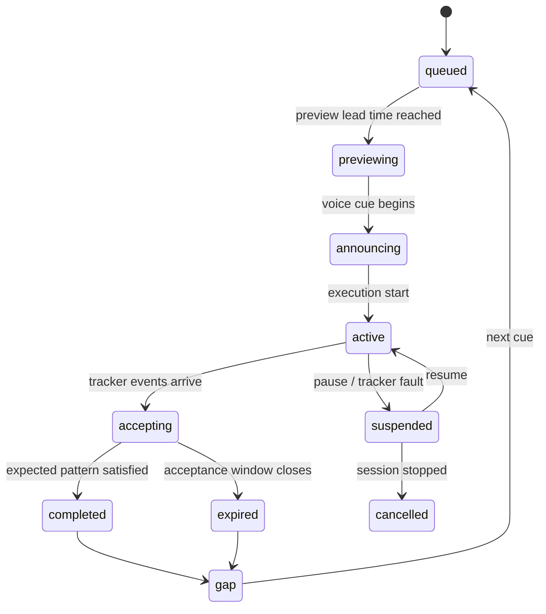

# punchCraft — Puncheokie UX and Workout Engine Design

> **Version 0.4 — authored 2026-08-22 (v0.2), landed and extended 2026-08-23 (v0.3), reconciled against on-device evidence 2026-08-23 (v0.4).** Parent document: [punchCraft — Product and Engineering Design Specification](design-spec.md) (spec §13, §15.2, §16, §17.1, §18, §22 Phase 5, §27). **Status: Accepted — canonical for Puncheokie.** Where this document and the spec disagree on Puncheokie, this document wins; the spec's §13 banner and §31 point here, and the "Status and supersession" table below lists every affected spec section. Owner: Kyle Ruff (`kyleruff1`). Work items: [roadmap.md](roadmap.md) Phase 5 and the Phase 5 fragment of [`tools/backlog/backlog-issues.json`](../tools/backlog/backlog-issues.json). Section numbers `§1`–`§28` are stable and may be cited from issues as "doc §n"; §29 records the landing decisions and §30 the revision history.

## Status and supersession

| # | Spec section | Effect | Resolution |
|---|---|---|---|
| C1 | §13.5, §14.1, §14.6 | amends | Voice Coach fully available when no third-party playback is active; OFF-by-default explicit toggle when Spotify is active; policy review at §22 Phase 7 task 10. See D1. |
| C2 | §13.4 `PunchProgram`/`ProgramRound`/`PunchCue`; §15.2 ProgramEngine/CueMatcher rows; §17.1 `punch_programs`/`program_rounds`/`punch_cues`; §21.1 | supersedes | `WorkoutBlock`/`WorkoutToken` (`punch`/`defense`/`footwork`/`coach`, body modifier `b`) replace `PunchCue{sequence:number[]}`. `ProgramEngine` becomes `CueEngine` + `WorkoutGenerator`; `CueMatcher` keeps its name and matches tokens. |
| C3 | §13.2, §13.3, §13.4 stance unions | supersedes | `defaultStance: 'orthodox' \| 'southpaw'`; block `stance: 'inherit' \| 'orthodox' \| 'southpaw' \| 'switch'`. "regular" is retired. See D2. |
| C4 | §3.4, §14.1, §14.6; CLAUDE.md rule 8 | clarifies — compatible | Cadence BPM is authored by the recipe/generator on the §18.3 monotonic clock; never derived from Spotify audio, Audio Features, track metadata, or playback position; no scopes beyond playlist-read. See D3. |
| C5 | §17.1, §22 Phase 5 tasks 1–2 + DoD, §27 MVP, §6 routes `programs.tsx`/`editor.tsx` | supersedes | Recipe + deterministic seeded generator replace editable programs and the editor; persistence = recipe params + `generator_version` + `seed`. Routes become `presets.tsx` + `recipe.tsx`. |
| C6 | §13.3, §13.6 scoring dimensions, §17.1 `cue_results` | clarifies | Defense/footwork/coach tokens are display-only and unscored; completion counts punch tokens only; **hand-sequence match** label on every scoring surface including the live count badge and summary. See D4. ⚠️ The tier clause originally read "hand + broad type (H11)" — **corrected to `hand + timestamp + velocity` by D12** after H12 refuted the vendor type flag on hardware. |
| C7 | §18.1 states, §18.2 acceptance, §11.5/§19.3 `recovering` | clarifies — naming | Cue states nest inside session `work`; `paused` suspends cues (`duringPause`); windows clamp to the active work interval; the cue-level post-window state is `gap`; block kind `active-recovery` unchanged. See D5. |
| C8 | §18.1 `rest` | clarifies | The three rest phases are presentation sub-phases of `rest`, not new session states. See D6. |
| C9 | §19.4, §22 Phase 7 task 8 | amends — Puncheokie live screen only | Landscape-first because the target is the tablet (§5.1); phone-width is the Phase 7 follow-up. See D7. |
| C10 | §8.6, §19.1, §17.1 | amends | Persist the realized token stream and every adaptation decision so recalculation is deterministic. See D8. |
| C11 | §8.3 pop-out tiles, §22 Phase 4 task 12 | clarifies | Fixed four-zone layout; the optional rail (≤ 4 tiles) is Puncheokie's tile-customization surface. See D9. |
| C12 | §19.4 no color-only indication | complies | The green/red/gold badge always carries text and an icon. |
| C13 | §15.1, §16 | amends — structure | Text-to-speech, audio focus, and ducking are Expo/Android APIs, so they live in `src/audio/` behind a domain port; `src/domain/coach/` stays pure. |

Tracker facts this design assumes (**H12, superseding the H11 reading, confirmed on-device 2026-08-23**): hand comes from the connection slot; there is a tracker epoch timestamp; velocity arrives as tracker-reported velocity in unlabeled tracker units; there is no sequence number; and **the payload's type byte carries no device-portable meaning at all** — not a distinct technique, and not the "two-value vendor flag (heavy versus standard)" this document assumed at v0.3. The tracker also **transmits nothing below an acceleration floor**, so a soft strike does not exist to the app. Anything beyond hand, timestamp and velocity is out of scope for scoring. See **D12** (tier) and **D13** (transmit floor); the original H11 wording is preserved in `docs/protocol/hypotheses.md` for provenance.

## 1. Core user flow

1. Open Puncheokie.
2. Choose or create a punch program.
3. Choose the athlete's default stance.
4. Optionally connect Spotify and select a playlist.
5. Confirm tracker readiness and calibration.
6. Open the playlist in Spotify or use an approved playback-control option.
7. Return to Puncheokie.
8. Start the workout countdown.
9. Follow visual and haptic punch cues.
10. Review completion, count, hand matching, velocity, and round metrics.

## 2. Punch numbering model

The application shall use lead/rear semantics internally and map them to physical hands based on stance.

Default six-punch mapping:

| Number | Technique role | Regular/default stance hand | Switch stance hand |
|---|---|---|---|
| 1 | Lead straight/jab | Left | Right |
| 2 | Rear straight/cross | Right | Left |
| 3 | Lead hook | Left | Right |
| 4 | Rear hook | Right | Left |
| 5 | Lead uppercut | Left | Right |
| 6 | Rear uppercut | Right | Left |

The user's "regular" stance may be configured as orthodox or southpaw. "Switch" always means the opposite lead/rear assignment.

## 3. Capability-aware scoring

Puncheokie must not claim technique recognition beyond the tracker data.

| Available event fields | Supported validation | FightCamp v1? |
|---|---|---|
| Hand only | Expected hand order and count | ✅ |
| Hand + timestamp | Hand order, count, and timing window | ✅ |
| Hand + broad type | Broad technique-family match | ❌ unreachable (D12) |
| Hand + distinct type | Full numbered technique match | ❌ unreachable (D12) |
| Velocity | Optional intensity-zone target | ✅ |

When only hand is known, a regular-stance 1-2-3 sequence maps to left-right-left. The app may score that hand pattern but must label the result hand-sequence match, not punch-technique accuracy.

**Tier reached on current hardware: `hand + timestamp + velocity`.** The two type rungs stay in this ladder for future decoders, but H12 showed the FightCamp v1 type byte carries no device-portable meaning, so neither is reachable today — see **D12**. The tier is resolved from connected-tracker capabilities at run time and is never hardcoded.

## 4. Program structure

A program contains rounds and scheduled cue blocks. It is independent of a specific music track. A cue block may contain exact punch tokens, a repeated pattern, a timed volume goal, defensive movement, footwork, or a coaching reminder.

```ts
export interface PunchProgram {
  id: string;
  name: string;
  description?: string;
  version: number;
  defaultStance: 'orthodox' | 'southpaw';
  rounds: ProgramRound[];
  generatorVersion?: string;
  seed?: string;
  createdAt: string;
  updatedAt: string;
}

export interface ProgramRound {
  id: string;
  order: number;
  theme: string;
  workDurationMs: number;
  restAfterMs: number;
  targetPunches: number;
  blocks: WorkoutBlock[];
}

export interface WorkoutBlock {
  id: string;
  kind:
    | 'exact-combo'
    | 'repeated-combo'
    | 'volume-burst'
    | 'defense-counter'
    | 'footwork-exit'
    | 'active-recovery'
    | 'open-pressure';
  startOffsetMs: number;
  durationMs: number;
  stance: 'inherit' | 'orthodox' | 'southpaw' | 'switch';
  tokens: WorkoutToken[];
  repeat?: number;
  targetPunches?: number;
  targetVelocityZone?: 1 | 2 | 3 | 4;
  graceBeforeMs?: number;
  graceAfterMs?: number;
  spokenPhrase?: string;
  instruction?: string;
}
```

Example program fragment:

```json
{
  "name": "Three-Round Fundamentals",
  "defaultStance": "orthodox",
  "generatorVersion": "1.0.0",
  "seed": "fundamentals-2026-08-22",
  "rounds": [
    {
      "order": 1,
      "theme": "Jab and cross rhythm",
      "workDurationMs": 180000,
      "restAfterMs": 60000,
      "targetPunches": 210,
      "blocks": [
        {
          "kind": "repeated-combo",
          "startOffsetMs": 0,
          "durationMs": 8000,
          "stance": "inherit",
          "tokens": [
            { "kind": "punch", "number": 1, "body": false, "beatOffset": 0 },
            { "kind": "punch", "number": 2, "body": false, "beatOffset": 0.75 }
          ],
          "repeat": 3,
          "spokenPhrase": "One, two. Three times."
        },
        {
          "kind": "defense-counter",
          "startOffsetMs": 8000,
          "durationMs": 10000,
          "stance": "inherit",
          "tokens": [
            { "kind": "defense", "command": "slip", "beatOffset": 0 },
            { "kind": "punch", "number": 2, "body": false, "beatOffset": 1 },
            { "kind": "punch", "number": 3, "body": false, "beatOffset": 1.75 },
            { "kind": "punch", "number": 2, "body": false, "beatOffset": 2.5 }
          ],
          "spokenPhrase": "Slip. Two, three, two."
        }
      ]
    }
  ]
}
```

## 5. Cue presentation

The live cue screen shall show:

- current stance;
- current numbered sequence in large type;
- lead/rear or left/right hand hints;
- repeat count;
- time remaining in the cue;
- next cue preview;
- round timer;
- actual punch count for the cue;
- sequence-match status; and
- optional velocity-zone status.

Puncheokie shall support an optional Voice Coach. Time-critical punch commands must be scheduled by the workout cue clock rather than allowing text-to-speech latency to control workout timing. Common numbers and commands may use short cached or prerecorded voice assets for deterministic timing, while text-to-speech may be used for longer announcements, round summaries, metric readouts, and user-selectable voice styles. Voice playback must remain logically separate from Spotify content; the application does not modify or redistribute the music stream.

## 6. Event-to-cue matching

Each cue defines an acceptance window:

```text
windowStart = cueStart - graceBefore
windowEnd   = cueEnd + graceAfter
```

Matching requirements:

- one punch event may be assigned to at most one expected punch;
- events are matched in event-time order;
- recovered events may be assigned after reconnection if their tracker timestamp supports reliable ordering;
- hand mismatch and type mismatch are separate outcomes;
- extra punches remain visible and may reduce precision but never disappear; and
- cue results are recalculable when decoder capabilities improve.

Initial scoring dimensions:

- completion percentage;
- correct-hand percentage;
- timing-window percentage;
- technique-category percentage when supported;
- average velocity by cue;
- target-zone percentage; and
- extra-punch count.

## 7. Puncheokie experience goals

Puncheokie should feel like a responsive boxing coach rather than a scrolling list of random numbers. The athlete should be able to configure a workout in less than one minute, understand exactly what has been enabled, begin without reading instructions during the round, and receive useful feedback without taking attention away from the bag.

The experience shall follow these principles:

- **Voice first, screen second:** the athlete should be able to complete a workout while only glancing at the screen occasionally.
- **Glanceable visual language:** numbers, body markers, defense symbols, stance, timer, and goal progress must remain recognizable at arm's length.
- **Controlled variety:** workouts should vary from day to day but repeat a small set of motifs within each round long enough for the athlete to learn and execute them.
- **Jab-led realism:** the generator should normally use the jab to establish range, start exchanges, or reset combinations.
- **Preference fidelity:** disabled punches, defenses, footwork, or coaching calls must never appear.
- **Capability honesty:** the app shall score only what the connected tracker data can support.
- **Stable pacing:** the workout should adjust gradually between cue blocks or rounds, never create a sudden impossible catch-up cadence.
- **No command overload:** the voice coach must not attempt to speak every punch during high-volume flurries.

## 8. Workout setup: the Workout Recipe

The setup screen should use progressive disclosure. The initial view contains only the choices needed for a useful workout. Detailed enablement controls live behind an Advanced Recipe panel.

### 8.1 Primary setup controls

**Duration:** 20 minutes · 30 minutes · 40 minutes · 60 minutes

**Punch goal:**

- suggested automatically from duration and focus;
- selectable from preset values;
- adjustable with minus/plus buttons or a compact slider;
- shown with a plain-language intensity label.

**Workout focus:**

- Hands: high punch density, fewer movement interruptions;
- Movement: more footwork, level changes, defense, and countering, with a lower suggested punch target;
- Balanced: an all-around mix.

**Stance:** Orthodox · Southpaw · Switch by round · Switch on command

**Bias:** Balanced · Lead-hand bias · Rear-hand bias · Physical-left bias · Physical-right bias

Lead/rear bias should be the default because it remains meaningful when the athlete changes stance. Physical-left/right bias is useful for rehabilitation, asymmetry work, or intentionally training one tracker/hand.

**Voice Coach:** Off · Minimal · Standard · Full

**Plan behavior:** Fixed plan · Adaptive pace · Goal-seeking

### 8.2 Advanced Recipe controls

The advanced panel contains:

- enabled punch families;
- body-shot percentage;
- enabled defensive movements;
- enabled footwork commands;
- enabled coaching reminders;
- maximum combo length;
- combo complexity;
- cue rhythm profile;
- defense frequency;
- footwork frequency;
- velocity-zone emphasis;
- metric announcement frequency;
- visual lead time;
- command vocabulary style; and
- whether extra punches are encouraged, neutral, or discouraged.

The bottom of the setup screen shall show a generated Recipe Summary before the workout starts. Example:

```text
30 minutes · 7 rounds · 1,800-punch target
Balanced · Orthodox with switch rounds
Jab 43% · Cross 25% · Hooks 20% · Uppercuts 12%
Body shots 18% · Defense 7 calls/round · Footwork 4 calls/round
Adaptive pace · Standard Voice Coach
Expected active pace: 86 punches/minute
```

The user can save the recipe as a named preset, duplicate it, or use Surprise Me to generate a new workout that honors the saved constraints.

## 9. Session duration and round schedule

The default work/rest structure is three minutes of work followed by one minute of rest. The duration choice includes inter-round rest and final cooldown. Because 30 minutes is not evenly divisible into four-minute cycles, it uses a short guided warm-up.

| Selected duration | Default schedule | Active work time |
|---|---|---|
| 20 minutes | 5 × 3:00 rounds, 4 × 1:00 rests, 1:00 cooldown | 15 minutes |
| 30 minutes | 2:00 guided warm-up, 7 × 3:00 rounds, 6 × 1:00 rests, 1:00 cooldown | 21 minutes |
| 40 minutes | 10 × 3:00 rounds, 9 × 1:00 rests, 1:00 cooldown | 30 minutes |
| 60 minutes | 15 × 3:00 rounds, 14 × 1:00 rests, 1:00 cooldown | 45 minutes |

A separate preparation countdown, defaulting to 10 seconds, occurs before the session clock begins.

The user may later be allowed to override the schedule, but the first Puncheokie release should preserve the standard 3:00/1:00 structure to keep generation and target calculations predictable.

## 10. Punch-goal presets and intensity labels

The 20-minute preset values are: 800 · 1,000 · 1,200 · 1,500 · 2,000.

Equivalent intensity tiers can scale with duration:

| Intensity label | 20 min | 30 min | 40 min | 60 min |
|---|---|---|---|---|
| Technique | 800 | 1,200 | 1,600 | 2,400 |
| Steady | 1,000 | 1,500 | 2,000 | 3,000 |
| Hard | 1,200 | 1,800 | 2,400 | 3,600 |
| High Volume | 1,500 | 2,250 | 3,000 | 4,500 |
| Extreme | 2,000 | 3,000 | 4,000 | 6,000 |

The labels are product pacing labels, not universal fitness standards. The setup screen should also display the implied active-work rate. For the 20-minute schedule, the presets imply approximately:

| Target | Punches per 3-minute round | Active punches/minute |
|---|---|---|
| 800 | 160 | 53 |
| 1,000 | 200 | 67 |
| 1,200 | 240 | 80 |
| 1,500 | 300 | 100 |
| 2,000 | 400 | 133 |

The Extreme tier requires sustained flurry blocks and should display a warning that it is a specialized high-volume target. The app should not try to individually speak 400 punch commands in a three-minute round.

Suggested targets should also change with workout focus:

- Hands: use the selected tier directly.
- Balanced: default to approximately 85–95% of the Hands target.
- Movement: default to approximately 65–80% of the Hands target because defensive and footwork calls consume active time without adding punches.

## 11. Stance, numbering, and hand bias

Numbers always describe lead/rear technique roles:

- 1: lead jab
- 2: rear cross
- 3: lead hook
- 4: rear hook
- 5: lead uppercut
- 6: rear uppercut

Body variations append a body modifier: `1b` through `6b` in authored notation, rendered as a **B** badge on the token.

The visual layer may optionally add a small physical-hand hint below each number. For example, in orthodox stance, 1 may show L and 2 may show R. In southpaw or switch stance, those hints reverse while the numbering remains unchanged.

Bias is implemented as a generator weight, not a hard requirement on every combination. A lead-hand bias may increase lead-hand punches from a nominal 50% share to a configurable range such as 58–68%, while still preserving realistic rear-hand counters. A hard one-hand-only mode should be a separate drill type rather than an extreme bias setting.

When Switch on command is enabled, stance changes should occur only at explicit reset points. The voice and screen must announce the change clearly:

> "Reset. Switch stance."

A stance change should never be inserted in the middle of a punch combination.

## 12. Command enablement menu

The enablement menu should group commands by purpose and use large switches with short examples.

**Punches:** Jab / 1 · Cross / 2 · Lead hook / 3 · Rear hook / 4 · Lead uppercut / 5 · Rear uppercut / 6 · Body variations / B · Double-up variations

**Defense:** Duck · Bob and weave · Slip · Roll · Pull

Defense frequency options:

- Off
- Light: approximately 2–3 calls per round
- Moderate: approximately 5–8 calls per round
- Heavy: approximately 9–14 calls per round

**Footwork:** Pivot · Step off · Circle · Cut off the ring · Reset

**Coaching and pace calls:** Double up · Put it on 'em · Touch and go · Breathe · Hands up

Breathe and Hands up are reminders, not scored actions. They should be scheduled during gaps, recovery windows, or immediately after a combination rather than spoken over a punch command.

When a user disables a prerequisite, the generator should explain the consequence. Example: disabling the jab while selecting a jab-heavy workout should trigger a clear recipe conflict, not silently ignore the preference.

## 13. Visual command grammar

The workout screen should use a consistent visual grammar:

- **Punch numbers:** large circular tokens.
- **Body shots:** the same numbered circle with a prominent B badge and a lower-screen placement cue.
- **Defense:** rounded rectangular or hexagonal tokens with a word and simple motion icon.
- **Footwork:** arrow-shaped tokens or a ring/angle diagram.
- **Coaching reminders:** horizontal banner text, visually subordinate to active commands.
- **Stance change:** full-width high-contrast card with left/right foot orientation.

Examples:

```text
  ( 1 )  ( 2 )  ( 3 )
   JAB    CROSS   HOOK

  ( 1B )  ( 2 )   [ ROLL ]  ( 3 )  ( 2 )
```

The active token receives a bright animated ring. Completed tokens become subdued and receive a small check or hit flash. Upcoming tokens remain high contrast but unfilled. A missed or unmatched token should not flash red during the combination because that is distracting; mismatch feedback belongs in the cue result or round summary.

## 14. Cue block types

A workout is built from several block types rather than a single list of punches.

**Exact combo** — Example: 1-2-3-2. The app calls and displays a fixed sequence. Best for technique, learning, and tracker hand-order validation.

**Repeated combo** — Example: 1-1-2 × 4. The sequence is shown once with a repeat counter. The voice coach says the combo and repeat instruction rather than speaking every repetition.

**Timed volume burst** — Example: Put it on 'em — 1-2s for 10 seconds. The app shows the allowed pattern and a short countdown. The tracker count, not individually enumerated commands, determines output. This block is essential for high punch-count targets.

**Defense-counter block** — Example: Slip — 2-3-2. The defense action consumes time but does not count as a punch.

**Footwork-exit block** — Example: 1-2 — pivot — reset. Useful in Movement and Balanced workouts.

**Active recovery block** — Example: light jabs, circle, breathe, hands up. Maintains engagement while reducing velocity expectations.

**Open pressure block** — Example: Touch and go for 15 seconds; finish every exchange with a 2. The app measures total punches and optional hand/type constraints without prescribing every punch.

This mixed block model allows the total goal to remain high without making the voice coach or visual interface unusable.

## 15. Combo library and realistic generation

Puncheokie should combine a curated combo library with a constraint-based procedural arranger. It should not create combinations by selecting random numbers independently.

Each combo template should include tags and constraints:

```ts
export interface ComboTemplate {
  id: string;
  name: string;
  tokens: WorkoutToken[];
  difficulty: 1 | 2 | 3 | 4 | 5;
  tags: Array<
    | 'jab-led'
    | 'straight'
    | 'hook'
    | 'uppercut'
    | 'body'
    | 'defense'
    | 'footwork'
    | 'pressure'
    | 'counter'
    | 'switch-safe'
  >;
  punchCount: number;
  expectedDurationBeats: number;
  allowedStances: Array<'orthodox' | 'southpaw' | 'either'>;
  requiredEnabledCommands: string[];
  followUpTags?: string[];
  forbiddenFollowUpTags?: string[];
}
```

Starter combinations should include: 1 · 1-2 · 1-1-2 · 1-2-1 · 1-2-3 · 1-2-3-2 · 1-1-2-3 · 1-2-5-2 · 1-2b-3-2 · 1b-2-3-2 · 1-slip-2 · 1-2-roll-3-2 · 1-2-pivot-2 · 1-1-step off-2 · 3b-2-3-2 · 1-6-3-2

Initial generation rules:

- normally keep 35–55% of punches as jabs, depending on focus;
- start approximately 60–80% of structured combinations with a jab or double jab;
- limit beginner combos to 2–3 punches;
- limit intermediate combos to 3–5 punches;
- use 4–8 punch strings only in advanced or pressure blocks;
- avoid more than two same-side heavy punches in sequence unless the template is an explicit drill;
- do not insert stance changes inside combinations;
- follow defense calls with a plausible counter or reset;
- insert an exit, reset, or movement beat after longer heavy-punch combinations;
- ensure disabled commands never appear indirectly through a template;
- keep each round centered on 3–6 recurring motifs; and
- introduce no more than two materially new motifs in one round.

The generator should create variation through round themes and sequencing, not through constant novelty. Repetition is part of the training experience.

## 16. Round themes and workout variation

A generated workout should assign one theme to each round. Example themes:

- Establish the jab
- Double-jab entries
- Straight-punch volume
- Lead-hook counters
- Body-to-head changes
- Defense and counter
- Footwork and exits
- Switch-stance fundamentals
- Pressure combinations
- Final high-volume round

A five-round 20-minute workout might use:

- Round 1: Jab rhythm and 1-2 fundamentals
- Round 2: Double jab, cross, and exits
- Round 3: Hooks after straights
- Round 4: Body-head transitions with slips and rolls
- Round 5: Pressure round with structured flurries

A deterministic random seed shall be stored with the workout. The same recipe, generator version, and seed must reproduce the same plan. This supports replay, debugging, sharing, and comparison between tracker-decoder versions.

## 17. Rhythm and cadence model

The workout engine should represent timing in beats, then map beats to milliseconds using a selected internal cadence. Music may play in the background, but the workout clock remains authoritative unless a future, separately validated beat-alignment feature is added.

Suggested cadence profiles:

| Profile | Nominal cadence | Typical use |
|---|---|---|
| Technical | 80–90 BPM | single shots, defense, deliberate form |
| Steady | 95–110 BPM | 2–4 punch combinations |
| Pressure | 110–130 BPM | longer combinations and repeated patterns |
| Sprint | 130–150 BPM | short flurry windows only |

A combination contains token offsets rather than equal delays between every action. Example:

```ts
const oneTwoThreeTwo = {
  tokens: [
    { command: '1', beatOffset: 0.0 },
    { command: '2', beatOffset: 0.75 },
    { command: '3', beatOffset: 1.55 },
    { command: '2', beatOffset: 2.30 }
  ],
  gapBeats: 2.0
};
```

The user-facing pace control should adjust three variables together:

- average punch density;
- gap between blocks; and
- proportion of exact combos versus volume bursts.

At high punch goals, the app should primarily increase repeated and timed-volume blocks. It should not simply shorten every pause until commands become unintelligible.

## 18. Voice Coach and visual synchronization

The workout scheduler, not the speech engine, is the master clock. Voice, visuals, haptics, and tracker matching subscribe to the same scheduled cue timeline.

### 18.1 Recommended voice modes

**Call and Go** — The full combo appears. The coach speaks the complete phrase: "One, two, three, two." A short ready tone follows. The visual cursor then guides execution. Best default for beginners and noisy environments.

**Follow the Call** — Each token is spoken and highlighted individually. Limited to slower technical cadences and short combinations.

**Coach Shorthand** — The coach speaks the complete combination once. Repetitions use beeps, visual pulses, and a repeat counter. Best default for normal and high-volume workouts.

**Minimal** — Voice only announces stance changes, special commands, round events, and metric summaries.

### 18.2 Time-critical versus descriptive audio

Time-critical audio should use deterministic short assets or cached phrases. **These are pre-rendered offline and never synthesized at runtime — see D16.** The list below is the closed vocabulary, and because D15 adds a second vocabulary it is rendered twice (numbers and names):

- 1 through 6;
- body suffix;
- slip, roll, duck, pull;
- pivot, step off, reset;
- go, stop, switch;
- round bell and warning tones.

Text-to-speech is well suited for:

- "Round three begins in ten seconds";
- "Two hundred forty-six punches, six over target";
- "Average velocity six point eight";
- generated workout summaries;
- custom program names; and
- accessibility descriptions.

The app should prepare the next several voice cues before they are needed. Metric announcements shall never interrupt a combination. Audio priority order:

1. stop/pause/system safety cue;
2. round bell or final countdown;
3. stance change and active punch command;
4. defense or footwork command;
5. metric announcement;
6. optional coaching reminder.

When music is playing, the app may lower its own nonessential sounds or request temporary audio focus/ducking as supported by the platform. The workout must remain usable when voice playback is unavailable; visuals and haptics are always retained.

### 18.3 Cue timing example

```text
T - 1.50s  Next combo appears dimmed
T - 0.75s  Voice says "One, two, three, two"
T - 0.10s  Ready tone / visual ring contracts
T + 0.00s  First token becomes active
T + 0.45s  Second token becomes active
T + 0.95s  Third token becomes active
T + 1.45s  Fourth token becomes active
T + 2.20s  Combo result locks; gap begins
```

The exact offsets vary by cadence profile and combo template.

## 19. Live workout screen

The live screen should preferably use landscape orientation on a tablet. It contains four visual zones:

```text
┌─────────────────────────────────────────────────────────────┐
│ ROUND 3 / 7       01:42       ORTHODOX       ●L ●R          │
│                                                             │
│ NEXT:  1 - 2 - ROLL - 3 - 2                                 │
│                                                             │
│          ( 1 )   ( 2 )   [ ROLL ]   ( 3 )   ( 2 )           │
│            └────────── active timing ring ──────────┘       │
│                                                             │
│       ACTUAL 126 / ROUND GOAL 240      PACE 82 / MIN        │
│                                                             │
│  AVG VELOCITY 6.8     LAST 7.4     LEFT 64 / RIGHT 62       │
│                                                             │
│                     [  PAUSE  ]                             │
└─────────────────────────────────────────────────────────────┘
```

### 19.1 Top status bar

- round number;
- countdown timer;
- stance;
- left/right tracker connection and battery status;
- subtle warning when operating in degraded mode.

### 19.2 Cue stage

- the active combination occupies most of the screen;
- active token is emphasized with an animated circular ring;
- full combination remains visible so the athlete can anticipate it;
- next combination appears above in smaller dimmed form;
- repeat count appears as ×4 or a shrinking stack of dots;
- body shots and movement calls use distinct shapes and spatial cues.

### 19.3 Goal and metrics rail

Default metrics:

- actual punches / round target;
- current required pace;
- average velocity;
- most recent accepted velocity;
- left/right counts.

Optional user-selected tiles:

- peak velocity;
- velocity zone;
- left/right balance;
- correct-hand percentage;
- combo completion;
- punches in the last 15 seconds;
- projected final count; and
- connection completeness.

The user should choose no more than four secondary tiles. Too many metrics reduce glanceability.

### 19.4 Controls

Only large controls belong on the active screen:

- pause/resume;
- emergency stop;
- optional skip cue;
- optional repeat cue.

All other settings are locked until rest or pause.

## 20. Cue lifecycle and state machine



The cue engine shall preserve these distinct timestamps:

- scheduled preview;
- actual preview;
- scheduled voice start;
- actual voice start;
- scheduled execution start;
- actual execution start;
- tracker-event time;
- acceptance-window close; and
- cue completion.

This allows visual/audio latency and tracker latency to be measured independently.

## 21. Tracker feedback and cue matching

Tracker capability determines what can be scored:

- **Count only:** actual punches and pace. — *available*
- **Hand:** expected left/right sequence and extra punches. — *available*
- **Broad type:** straight, hook, uppercut family matching. — **unavailable on FightCamp v1 (D12)**
- **Detailed type:** full number matching. — **unavailable on FightCamp v1 (D12)**
- **Velocity:** average, peak, zone, and consistency. — *available*

Defense and footwork commands are not automatically marked as failed when the trackers cannot observe them. They are instructional time blocks. Body-versus-head placement is also unscored unless the protocol reliably distinguishes it.

The same reasoning now extends to technique itself: because the type byte is not device-portable (D12), *which* punch was thrown is unobservable, and no surface may assert it. Two combinations with the same hand sequence — `1-2-3` and `1-2b-3` are both left-right-left — are indistinguishable to the tracker and are scored identically. The cue tells the athlete which to throw; the tracker only confirms the hand fired in the window. This is precisely what the **hand-sequence match** label means.

A `missed` outcome is likewise ambiguous: the tracker transmits nothing below an acceleration floor, so a strike thrown too softly and a strike not thrown at all are the same absence of evidence (D13). Neither may be presented as a failure.

Every received punch should produce immediate but subtle feedback:

- the active token briefly brightens;
- the actual punch counter increments;
- the latest velocity tile updates;
- an optional low-intensity haptic pulse confirms receipt.

Extra punches remain counted. Depending on the selected workout behavior, they may be:

- encouraged in volume blocks;
- neutral in standard mode; or
- marked as extras in precision mode.

## 22. Adaptive pacing and goal seeking

The engine maintains:

```text
remainingPunches = totalGoal - acceptedPunches
remainingActiveSeconds = sum(unelapsed active-work time)
requiredPace = remainingPunches / remainingActiveSeconds * 60
```

The app shall not react to every punch by immediately changing tempo. Adjustments occur at safe boundaries:

- after a cue block;
- during a rest;
- or at the start of the next round.

**Fixed plan** — Never changes the generated cue schedule. Best for repeatable benchmark workouts.

**Adaptive pace** — Adjusts future gaps and repeat counts gradually. Default limit: approximately ±10–15% cadence change per round. Preserves the workout theme and technique distribution.

**Goal-seeking** — Reallocates punch budget across remaining rounds. Adds or lengthens volume blocks when behind. Adds defense, footwork, or recovery when far ahead. Never inserts a catch-up block that exceeds the configured maximum cadence.

The live UI should show required pace and projected total, but avoid continuously warning the athlete. A single cue such as "Build the pace" or "You are ahead; stay sharp" is enough at periodic boundaries.

## 23. Round transition and grading

At the bell, the app freezes the round result and enters the one-minute rest screen.

The primary result is a large circular count badge:

- **Green:** actual count is greater than the round goal.
- **Red:** actual count is below the round goal.
- **Gold:** actual count exactly equals the round goal.

Color must not be the only indicator. Include text and an icon:

```text
GREEN  246 / 240   +6 OVER
RED    221 / 240   19 SHORT
GOLD   240 / 240   EXACT TARGET
```

The one-minute rest can be divided into three phases:

**0–12 seconds: result** — count badge; over/under/exact status; round velocity average; brief Voice Coach summary.

**12–45 seconds: recovery** — heart-rate-style breathing animation, if desired; left/right count balance; best combo or best velocity; connection warning if a tracker dropped.

**45–60 seconds: next-round preview** — next theme; enabled stance; two sample combinations; countdown and voice announcement.

Example announcements:

> "Round two complete. Two hundred forty-six punches, six over target. Average velocity six point eight. Next round: hooks after the jab."

> "Perfect target. Two hundred forty punches. Recover. Switch stance in thirty seconds."

The round result should not use a letter grade by default. The count target is clear and objective. Secondary badges may recognize:

- pace consistency;
- velocity consistency;
- left/right balance;
- best round;
- exact sequence streak; and
- complete tracker coverage.

## 24. End-of-workout summary

The final summary should lead with:

- total punches versus target;
- total target result using the same green/red/gold treatment;
- completed rounds;
- average and peak tracker-reported velocity;
- left/right split;
- average punch rate;
- most productive round;
- best velocity round;
- connection completeness; and
- selected recipe and generator seed.

Additional analysis can be expanded below:

- actual versus target by round;
- pace graph;
- velocity trend;
- hand balance;
- structured-combo completion;
- volume-block output;
- defense/footwork commands issued;
- extra punches;
- missed or skipped cues; and
- tracker interruptions.

The user can save the workout as a reusable preset or select Run This Exact Workout Again, which reuses the generator seed.

## 25. Accessibility, usability, and safety

- Keep the screen awake during active rounds.
- Support high-contrast and color-blind-safe labels; never rely on color alone.
- Allow large text and reduced-motion modes.
- Keep all active controls glove-friendly and separated.
- Provide independent volume controls for music, voice, bells, and haptics where the platform permits.
- Allow a no-voice mode for shared spaces.
- Do not announce every velocity value; default to periodic averages, personal-best callouts, and round summaries.
- Provide a configurable final-ten-second warning.
- Never encourage the athlete to accelerate solely to recover an impossible target.
- Label high-volume targets clearly.
- Include an immediate stop action accessible from the active screen.

## 26. Workout-generation data contracts

```ts
export type PunchNumber = 1 | 2 | 3 | 4 | 5 | 6;
export type Stance = 'orthodox' | 'southpaw';

export type WorkoutToken =
  | {
      kind: 'punch';
      number: PunchNumber;
      body: boolean;
      beatOffset: number;
      velocityZone?: 1 | 2 | 3 | 4;
    }
  | {
      kind: 'defense';
      command: 'duck' | 'bob-weave' | 'slip' | 'roll' | 'pull';
      beatOffset: number;
    }
  | {
      kind: 'footwork';
      command: 'pivot' | 'step-off' | 'circle' | 'cut-off-ring' | 'reset';
      beatOffset: number;
    }
  | {
      kind: 'coach';
      command: 'double-up' | 'put-it-on-em' | 'touch-and-go' | 'breathe' | 'hands-up';
      beatOffset: number;
    };

export interface WorkoutRecipe {
  durationMinutes: 20 | 30 | 40 | 60;
  totalPunchGoal: number;
  focus: 'hands' | 'movement' | 'balanced';
  defaultStance: Stance;
  stanceMode: 'fixed' | 'switch-by-round' | 'switch-on-command';
  bias: 'balanced' | 'lead' | 'rear' | 'left' | 'right';
  enabledPunches: PunchNumber[];
  bodyShotPercent: number;
  enabledDefense: Array<'duck' | 'bob-weave' | 'slip' | 'roll' | 'pull'>;
  enabledFootwork: Array<'pivot' | 'step-off' | 'circle' | 'cut-off-ring' | 'reset'>;
  enabledCoachCalls: Array<'double-up' | 'put-it-on-em' | 'touch-and-go' | 'breathe' | 'hands-up'>;
  maximumComboPunches: number;
  defenseFrequency: 'off' | 'light' | 'moderate' | 'heavy';
  footworkFrequency: 'off' | 'light' | 'moderate' | 'heavy';
  cadenceProfile: 'technical' | 'steady' | 'pressure' | 'sprint';
  voiceMode: 'off' | 'minimal' | 'standard' | 'full';
  adaptationMode: 'fixed' | 'adaptive' | 'goal-seeking';
  generatorVersion: string;
  seed: string;
}

export interface GeneratedWorkout {
  id: string;
  recipe: WorkoutRecipe;
  schedule: ProgramRound[];
  roundPunchTargets: number[];
  expectedTechniqueDistribution: Record<string, number>;
  estimatedActivePunchesPerMinute: number;
  warnings: string[];
}
```

## 27. Recommended implementation sequence for the game interface

1. Build the Workout Recipe screen with hard-coded sample programs.
2. Build the landscape live screen using a simulated punch-event stream.
3. Implement the cue clock, number circles, active-token animation, and round timer.
4. Implement the Voice Coach with a small fixed vocabulary and three voice modes.
5. Implement exact-combo and repeated-combo blocks.
6. Implement tracker count/velocity overlays without scoring technique.
7. Implement round results with red/green/gold goal treatment.
8. Add timed volume blocks and total-goal allocation.
9. Add defense, footwork, body-shot, and stance-change tokens.
10. Add capability-aware hand/type matching.
11. Add adaptive pace and goal-seeking behavior.
12. Add the procedural generator after a curated library of approximately 40–60 tested combo templates exists.
13. Add saved recipes, deterministic seeds, and "run exact workout again."
14. Test audio/visual synchronization while Spotify plays in the background.
15. Conduct bag testing to tune pauses, acceptance windows, and realistic punch-density ceilings.

The live screen and cue engine should be built against simulated events before the BLE protocol work is complete. This lets the UX mature independently while the tracker adapter is being mapped.

## 28. Strike confirmation, combo plausibility, and gratification

Added in v0.3 (2026-08-23). This section defines what happens on the screen and in the athlete's hands the instant a strike lands, how the app decides that a displayed combination was *probably* thrown, and what it does to acknowledge that. It sits on top of §6 matching and §21 feedback and is bound by §3 and D4: nothing here may claim technique recognition the tracker cannot support.

### 28.1 Why plausibility rather than proof

The confirmed tracker (**H12**) reports which slot fired, a tracker timestamp, and tracker-reported velocity — and a type byte that carries no device-portable meaning, so it is not used (D12). It cannot report that a strike was a hook rather than a cross. When the screen shows `1-2-3` in orthodox — left, right, left — the tracker can only establish that a left, a right, and a left arrived, in that order, inside the window.

Confirmation is therefore **evidential, not definitive**: the app grades how consistent the observed strikes are with the displayed combination and says so in those words. Every label remains **hand-sequence match** (D4). A high-confidence result means "the strikes you threw are consistent with this combination", never "your technique was correct".

### 28.2 Per-strike confirmation: node flash and haptic

Each accepted punch event resolves to a hand from its tracker slot — hand is never in the payload (H11), it comes from the `deviceId` → slot assignment. The engine then looks for the token that strike most plausibly fills: the earliest unfilled expected punch whose hand equals the event hand and whose acceptance window contains the event time.

- **Filled.** The node flashes a confirming state — brightens, gains an accent ring, and takes a check glyph — and a `confirm` haptic pulse fires. The node is now filled and cannot be filled again (§6: one event, at most one expected punch).
- **Unmatched.** The strike still counts. Counters and the extras readout increment and a dimmer, non-accent acknowledgement pulse fires. There is **no red flash and no failure animation mid-combination** (§13); a mismatch is reported in the cue result and the round summary, not thrown at the athlete between punches.

The haptic vocabulary is deliberately small, because the athlete is mid-round and cannot parse subtlety through a wrap:

| Cue | Pattern | Meaning |
|---|---|---|
| `confirm` | one light pulse | a strike filled its expected node |
| `extra` | one very short, lighter pulse | counted, but filled no expected node |
| `combo-complete` | medium double pulse | a combination closed at `confirmed` or `likely` |
| `streak` | medium triple pulse | a streak threshold was reached |

Nothing longer or more elaborate is used. Intensity is user-adjustable and the whole haptic channel can be switched off (§25); the visual state never depends on haptics being available.

### 28.3 The combo affirmation border

The row of tokens for the active combination carries a border that expresses progress:

- As nodes are confirmed, the border **fills progressively** — after *k* of *n* expected nodes, it is drawn *k/n* of the way around the strip.
- When the last expected node is confirmed, the border **completes and sweeps once**, carrying the confidence tier's glyph and label.
- If the window closes with *k < n*, the border **stops where it is and fades**. No red, no shake, no failure sound. The shortfall belongs to the cue result and the round summary.

Under reduced motion the border steps between states instead of animating, and the sweep is replaced by a single state change. The border is never the only signal: tier glyph, text label, and border thickness all carry the same information (§19.4).

### 28.4 The plausibility model

For each combination instance the engine computes signals in the range 0..1:

| Signal | What it measures |
|---|---|
| `handOrder` | ordered agreement between the expected hand sequence and the hands observed inside the window |
| `timing` | fraction of confirmed nodes whose strike landed inside its token window, weighted by how centred it was |
| `separation` | whether inter-strike intervals are consistent with the block's cadence — guards against one flail registering as three |
| `intensity` | agreement between the emphasis a combination implies and the observed tracker-reported velocity. ⚠️ The vendor-type-flag input is removed by **D12** — velocity alone on FightCamp v1, and the signal is omitted entirely if velocity is unavailable |
| `exclusivity` | whether extra strikes were interleaved between confirmed nodes |

`confidence` is the weighted mean of the signals **that the connected tracker can actually supply**. This is the load-bearing rule: a signal the capability tier cannot produce is **omitted from the mean, never scored as zero**. An absent capability must never look like athlete failure. Weights are constants, tuned on the bag (M36-03).

Confidence tiers:

| Tier | Confidence | Meaning |
|---|---|---|
| `confirmed` | ≥ 0.85 | every expected node filled; order, timing and separation all clean |
| `likely` | ≥ 0.60 | order clean; timing, separation or intensity partly inconsistent |
| `partial` | ≥ 0.30 | some expected nodes filled |
| `unconfirmed` | < 0.30 | the window closed without a usable match |

The computation is pure and versioned (`CONFIDENCE_VERSION`). The tier, the confidence, and every input signal are persisted so an improved decoder or a retuned weight set can recompute historical sessions without touching raw events (D8, spec §8.6).

### 28.5 Gratification

Acknowledgement escalates, but stays bounded — this is a training instrument, not a slot machine.

| Level | Trigger | Response |
|---|---|---|
| Node | a strike fills an expected node | micro flash + `confirm` haptic |
| Combination | closes at `confirmed` or `likely` | affirmation border sweep + tier label + `combo-complete` haptic + optional short tone |
| Streak | consecutive combinations at `likely` or better | streak counter increments; the badge pulses at 3, 5 and 10 |
| Round | the bell | existing count badge (§23) plus confirmed-combination count and best streak |
| Session | the summary | breakdown by tier and longest streak (§24) |

Four rules govern all of it:

1. **Never celebrate what did not happen.** A combination that closes `partial` shows progress, not celebration.
2. **Never punish.** There is no red state, no buzz, no failure sound anywhere in this system.
3. **Always optional.** A Focus mode disables celebration entirely and leaves counters and the timer.
4. **Never used to push pace.** Gratification never escalates to drive the athlete toward an unreachable target (§25).

The optional tone obeys the Voice Coach gate: it does not play over third-party playback unless the athlete has explicitly opted in (D1).

### 28.6 Honesty, accessibility, and determinism

- Labels read "combination confirmed — hand-sequence match" or "combination likely — hand-sequence match". Never "perfect technique", never a claim about which punch was thrown.
- Every state is carried by glyph, text, and shape as well as colour (§19.4), with reduced-motion and haptics-off variants.
- Confidence, tier, signals and `CONFIDENCE_VERSION` persist with each combination result so results are recalculable (D8).

## 29. Resolved decisions (landing, 2026-08-23)

These decisions were taken when this document was landed against spec v1.0. They are mirrored in spec §25 and are versioned with this document.

**D1 — Voice Coach availability and the third-party-playback gate.** The Voice Coach is a first-class Puncheokie feature and is fully available whenever no third-party playback is active. Whenever Spotify (or any other third-party player) is playing, or the user opened a playlist from Puncheokie in the current session, spoken cues are gated behind an explicit toggle that defaults to OFF, whose label states that it will speak over the user's music; the app never enables it automatically and the choice persists per user. When enabled over music, speech uses a separate Android audio stream with transient, may-duck audio focus and never alters, records, or analyzes Spotify audio. This amends spec §13.5 and §14.6 ("no overlay … by default" now means exactly this gate) and is reviewed under §22 Phase 7 task 10 before any public distribution; if that review fails, the toggle is removed and the Voice Coach remains available without third-party playback.

**D2 — Stance enum.** `defaultStance` is `'orthodox' | 'southpaw'`. A block's `stance` is `'inherit' | 'orthodox' | 'southpaw' | 'switch'`, where `switch` means the opposite of the athlete's default and the absolute values force a stance regardless of default. "Regular" is retired as a value because spec §13.2/§13.3 silently equated it with orthodox. Numbered roles stay lead/rear (1/3/5 lead, 2/4/6 rear); `StanceMapper` resolves role → hand from the effective stance; the body modifier marks a body target and never changes the hand.

**D3 — Cadence is authored, never derived.** BPM cadence profiles are recipe parameters expanded by the generator and scheduled on the §18.3 monotonic clock. The app never derives tempo from Spotify audio, the Audio Features/Analysis endpoints, the playing track's metadata, microphone input, or playback position; it requests no scopes beyond `playlist-read-private` (and `playlist-read-collaborative` only if needed); and it never aligns a cue to a song. Cadence therefore coexists with "no beat sync" (§3.4, §14.6, CLAUDE.md rule 8): any coincidence between cadence and music is accidental, and the workout is identical with music off.

**D4 — Scoring scope and labeling.** ⚠️ *Partially superseded by D12 — the tier clause below was wrong. Everything else in D4 stands.* The confirmed tracker (H11) reports hand (from the connection slot), ~~a power-punch vendor classification flag versus non-power~~, a tracker timestamp, and tracker-reported velocity in tracker units; it has no sequence number and cannot observe slips, rolls, pivots, or rests. Therefore defense, footwork, and coach tokens are display-only, never scored, and never counted toward completion; completion, correct-hand, and timing percentages are computed over punch tokens only; ~~the Puncheokie capability tier is "hand + broad type"~~ **(see D12: the tier is `hand + timestamp + velocity`)**; and every surface that shows a score — the live count badge, block and round readouts, and the session summary — labels it **hand-sequence match**, never technique accuracy.

**D5 — Cue lifecycle nests inside the session machine.** Puncheokie adds no states to spec §18.1. Cue states live inside `work`: session `paused` suspends every cue and flags punches `duringPause`; on resume, open windows continue from their remaining duration. A token's acceptance window is clamped to the enclosing active work interval (§18.2), so it never extends into `rest`, `paused`, or `finishing`. To avoid collisions, the cue-level post-window state is `gap` (BLE keeps `recovering`, §11.5/§19.3, and the event flag `recovered` is unchanged), the token timing field is `gapBeats`, the block kind `active-recovery` is unchanged, and cue-level terminal states are read as `cue.completed` / `cue.cancelled`, distinct from the session's `completed` / `cancelled`.

**D6 — Rest sub-phases.** The three rest phases are presentation sub-phases of the single §18.1 `rest` state, driven by the same monotonic timer; they do not appear in the session state machine, persistence, or metrics, and "skip rest" (§8.4) skips all three.

**D7 — Landscape-first live screen.** The Puncheokie live screen is designed landscape-first because the target device is the tablet (§5.1) mounted at the bag; this deliberately inverts §19.4's phone-first order for this one screen. The fixed four-zone layout is specified for landscape; the phone-width/portrait variant is the §22 Phase 7 task 8 follow-up and must not block Phase 5. All other screens keep the §19.4 order.

**D8 — Adaptive plans persist what actually happened.** Goal-seeking and adaptive recipes may change upcoming blocks mid-session. To keep §8.6/§19.1 deterministic recalculation true, `generated_workouts` stores the recipe parameters, `generator_version`, `seed`, the realized token stream as executed (including inserted, shortened, or dropped blocks), and each adaptation decision with its inputs and monotonic time. Recalculation replays the realized stream, never the recipe.

**D9 — The rail is the customization surface.** Puncheokie uses a fixed four-zone layout instead of §8.3's pop-out tiles. The optional rail holds up to four user-chosen tiles drawn from the §19.3 catalogue, and that rail is Puncheokie's implementation of §22 Phase 4 task 12. Tiles never displace the four primary zones.

**D10 — Combo notation.** The data model uses `body: boolean` on punch tokens. Authored and serialized string notation uses a lowercase `b` suffix (`1-2b-3-2`), matching the athlete-facing combo notation; the rendered token shows an uppercase **B** badge per §13. Parsing and formatting helpers live beside the token contracts so every module agrees on one notation.

**D11 — Confirmation is graded, capability-aware, and never punitive.** Strike confirmation (§28) grades how consistent observed strikes are with the displayed combination and reports a tier — `confirmed` / `likely` / `partial` / `unconfirmed` — rather than a pass or fail. Signals the connected tracker cannot supply are omitted from the confidence mean, never scored as zero, so an absent capability never reads as athlete failure. Every label stays **hand-sequence match** (D4); no surface claims which punch was thrown. Nothing in the system is punitive: no red state, no failure sound, no buzz, and celebration never fires for a combination that closed `partial` or worse. The confidence, its input signals and `CONFIDENCE_VERSION` persist with each combination result so a better decoder or a retuned weight set recomputes history without touching raw events (D8).

### Amendments landed at v0.4 (2026-08-23, after on-device verification)

**D12 - Capability tier corrected: hand + timestamp + velocity.** This document was authored against the H11 reading that the payload carries "a two-value vendor type flag (heavy versus standard)", and on that basis D4/C6 fixed the Puncheokie tier at "hand + broad type". **H12 refuted that reading on hardware.** A controlled isolated-punch capture (2026-08-23, ~100 events, 10 sets, both trackers, one athlete, one sitting) showed the type byte carries no device-portable meaning: hooks were byte 2 on `EA:69` (7/8) but byte 1 on `D7:34` (8/10), with zero byte-2 events in blue's hook set; and on `D7:34` the byte behaves as a *velocity gate* - every event with `velocityByteRaw >= 10` landed in {3,4} (13/13) and nearly every event <= 9 landed in {1,2} (32/34) - while `EA:69` shows no threshold at all. Blue's polarity is the opposite of "1/2 = heavy" and red has no mapping, so the flag is not portable in either direction.

This correction is required by this document's own rules - §3 "must not claim technique recognition beyond the tracker data" and §7 "shall score only what the connected tracker data can support" - and is therefore an application of D4's intent to new evidence, not a reversal of it.

Consequences, all binding:

- The FightCamp v1 capability tier resolves to **hand + timestamp + velocity**. The §3/§21 "broad type" and "detailed type" rungs are unreachable on this hardware; they remain in the ladder for future decoders.
- `cue_results.expected_type` is always `NULL`, and the `outcome` value `type-mismatch` is unreachable. It stays in the enum - a better decoder must be able to produce it without a migration.
- The §28.4 `intensity` signal loses its vendor-type-flag input. It is computed from tracker-reported velocity alone, or omitted entirely when velocity is unavailable - per D11, **omitted, never zeroed**.
- §6's "technique-category percentage when supported" is not supported and is not displayed.
- The tier is **resolved from connected-tracker capabilities at run time**, never hardcoded (M32-02). Nothing downstream may assume a richer tier.

**This constrains verification only, never prescription.** The coach still calls out any designed strike - all of 1-6, body variants, defense, footwork, coach calls - and the generator still prescribes "left hook to the body" with full precision. What the tracker cannot do is confirm *which technique landed*; it confirms that the expected hand fired inside the expected window with enough force to register. That asymmetry is exactly why the **hand-sequence match** label (D4) is the honest one, and why no part of the workout vocabulary shrinks.

**D13 - The transmit floor is a first-class limitation.** H12 also established that the tracker **sends no frame at all below an acceleration threshold**: ten deliberately soft uppercuts produced exactly one event, and Hykso's "not a real punch" bytes (0/5) never appeared, so the cutoff sits below the transmit stage rather than being a classification the app could observe and discard.

Therefore `cue_results.outcome: missed` is ambiguous by construction - it cannot distinguish "the athlete did not throw" from "the athlete threw, but too softly to exist to the sensor". Under D11 (an absent capability must never read as athlete failure) these must not be presented identically:

- The ambiguity is documented wherever completion percentage is surfaced; completion is never described as an accuracy or effort measure.
- The live screen never implies a missed node means a failed strike (already required by §13: no red flash mid-combination).
- Bag testing (M36-03) measures the practical floor in tracker units so the limitation can be stated concretely rather than qualitatively.

**D14 - Contract reconciliation before the model is frozen.** Cross-reading §4, §17 and §26 surfaced five inconsistencies. Resolutions, binding on M31-01:

1. §17's illustrative `{ command: '1', beatOffset }` literal is **not** a member of the §26 `WorkoutToken` union. **§26 is authoritative**; §17 is prose illustration and is not a contract.
2. `ComboTemplate.allowedStances` is declared as an array that can contain the value meaning "any". It becomes the **scalar** `allowedStance: 'orthodox' | 'southpaw' | 'either'`.
3. §26's `WorkoutRecipe` carries no `id`/`name` and omits seven §8.2 advanced controls (combo complexity, cue rhythm profile, velocity-zone emphasis, metric announcement frequency, visual lead time, command vocabulary style, extras policy). `id`/`name` live on the `workout_recipes` row, not the type. The seven advanced controls are **added to the type** rather than hidden in `params_json`, so the generator's inputs are statically checkable; `params_json` persists the whole typed object under `recipe_schema_version`.
4. Voice mode and voice vocabulary are **independent axes** - see D15.
5. §4's `PunchProgram` is **retired** (C5/D8 already removed editable programs). Only `ProgramRound` and `WorkoutBlock` survive, reached through `GeneratedWorkout.schedule`.

Versioned constants that gate recalculation are defined before the first row is persisted: `generator_version`, `recipe_schema_version`, `CONFIDENCE_VERSION`, `calculation_version`, `capability_tier`, alongside the existing `decoder_version`.

**D15 - Voice mode and voice vocabulary are independent.** §18.1 names four voice *behaviours* (Call and Go, Follow the Call, Coach Shorthand, Minimal) while §26 declares `voiceMode` with four *amount* values. These do not map 1:1 because they describe different things, and collapsing them into one enum is what produced the mismatch. They separate:

```ts
voiceMode:       'off' | 'minimal' | 'standard' | 'full'   // how much it speaks
voiceVocabulary: 'numbers' | 'names'                        // which words it uses
```

`numbers` speaks the digits - "one, two, three" - matching how a coach calls combos in a gym. `names` speaks the techniques - "jab, cross, left hook" - for athletes learning the numbering.

This is not only preference. **Phrase duration competes with the cue window**: at `sprint` cadence (130-150 BPM) the beat interval can be shorter than a phrase takes to speak, and "left hook to the body" is roughly four times the duration of "three". Consequently:

- `CueAnnouncer` knows each phrase's duration and **skips or downgrades rather than overlapping**. A queue of overrunning announcements drifts further behind every cue and ends up narrating the wrong punch - the failure mode §5 and §18 already forbid by making the scheduler, not the speech engine, the master clock.
- `numbers` is the automatic fallback when the cadence cannot fit `names`, and the downgrade is surfaced rather than silent.
- The §18.2 cached-asset manifest carries a clip set per vocabulary.

Vocabulary is orthogonal to the D1 third-party-playback gate: choosing a vocabulary never enables speech over music.

**D16 - Time-critical speech is pre-rendered, never synthesized at runtime.** The §18.2 time-critical vocabulary is a small closed set - 1 through 6, the body suffix, the defense and footwork words, go/stop/switch, bells and tones - which D15's second vocabulary renders twice, for roughly 50-60 clips per voice. Those clips are **generated ahead of time by a self-hosted open-source TTS model (Kokoro-82M) and shipped or prefetched as cached assets**. At workout time the app plays a local file and performs no synthesis and no network request.

This is not a fallback arrangement; it is better than on-device TTS for this set, for three reasons:

1. **Durations are measured, not estimated.** D15 requires `CueAnnouncer` to know each phrase's duration so it can skip or downgrade rather than overlap. A pre-rendered clip has an exact duration, recorded in the asset manifest. On-device TTS would force the announcer to guess whether a phrase fits the beat interval, and a wrong guess produces exactly the drift D15 exists to prevent.
2. **Prosody is consistent.** Device TTS varies by device, locale and engine version; the same cue would sound different on different tablets.
3. **No engine latency variance** inside the cue window. R5 requires the workout cue clock, not the speech engine, to control timing; removing synthesis from the runtime path removes the failure mode entirely.

It also preserves the spec's local-first stance: the generator runs offline as a build step and never ships, so there is **no runtime backend** on the core path, and R20 ("the workout must remain usable when voice playback is unavailable") holds without a network at the bag.

**Descriptive audio keeps on-device TTS.** Round summaries, punch-count and velocity announcements, and generated workout names are dynamic strings that cannot be pre-rendered. They fire at rest boundaries (§23) where a one- to two-second render is invisible against a 60-second rest, and they are already forbidden from interrupting a combination (§18.2).

A hosted synthesis endpoint for *descriptive* lines - higher quality than device TTS - is permitted only under all of these conditions: it is behind a flag, defaulting off; it is called at rest boundaries only, never inside a work interval; and it degrades to device TTS and then to silence without stalling the workout. Introducing it is a deliberate departure from local-first and requires its own decision; nothing in Phase 5 depends on it.

**Licensing gate.** Baked-in audio assets travel with the application, so the generating model's licence governs distribution. Kokoro-82M is Apache-2.0 and is the default choice for that reason. Any alternative model - XTTS among them - must have its licence verified against the actual licence text before its output is bundled; several community TTS models ship under non-commercial terms that would not permit distribution. When in doubt, Kokoro alone covers the entire closed vocabulary.

**Voice character - a grizzled old trainer: raspy, but firm.** The intended persona is a weathered, older, gym-corner coach. Not an announcer, not an assistant, not encouraging-app-cheerful. This is a product requirement on the Voice Coach, not a stylistic afterthought - the persona is most of what makes a called combination feel like coaching rather than a notification.

**"Raspy, but firm" is the whole specification, and the second half is the load-bearing one.** Rasp is texture; firmness is projection and authority. Texture alone degrades intelligibility - a low, gravelly, heavily-textured voice is harder to parse than a clean one, and it has to survive the worst case: a fast combination, at workout volume, over the noise of the athlete hitting a bag, from a tablet speaker at arm's length. Firmness is exactly what buys that back, because a firm delivery is clipped, projected and consonant-forward. So the two qualities are not in tension when both are present; they only conflict when rasp is pursued without it. **Where they do conflict, intelligibility wins** - a cue that is not understood mid-flurry is worse than a cue with less personality. §7 already requires the visual grammar to stay "recognizable at arm's length"; this is its audio equivalent.

Two levers matter beyond timbre:

- **Delivery.** A gym coach *barks* a combination; it is clipped and flat, not narrated. Rendering speed and flatness carry as much of the persona as the voice model does, and both are free to tune per clip because the assets are pre-rendered.
- **Consistency.** Because the vocabulary is closed and rendered once, every "two" sounds identical every time. That repetition is what makes a voice read as a person rather than a synthesizer.

**Selection is an audition, not a decision made on paper.** The whole time-critical vocabulary is rendered with each candidate voice and compared on the tablet, at the bag, at workout volume, against actual punching - not in headphones at a desk. Scoring criteria, in priority order: intelligibility of 1-6 mid-flurry; distinctness of the confusable pairs (notably "four"/"more" and the body-suffix forms); persona fit; and pleasantness over a 30-minute session, which is where an over-processed voice becomes fatiguing. This audition is part of M36-03 bag testing, alongside grace and cadence tuning.

If no stock voice reaches the bar, voice **cloning** from a reference recording is a technical option but carries a rights constraint independent of the model licence: the reference speaker must have consented to that use. Cloning a recognizable person's voice - a well-known trainer, for instance - is not available regardless of which model produces it. A consented recording of a willing speaker is fine.

**Asset manifest.** The manifest carries, per clip: vocabulary (`numbers` | `names`), token or phrase key, file reference, **measured duration in milliseconds**, sample rate, and the model plus voice identifier used to generate it. The model/voice identifier is recorded so a re-render is reproducible and so a voice change is a visible, versioned event rather than a silent asset swap.

## 30. Revision history

| Date | Version | Change |
|---|---|---|
| 2026-08-22 | 0.2 | Authored against the PunchLab Technical Design Document. |
| 2026-08-23 | 0.2 (landed) | Committed as `docs/puncheokie-ux-workout-engine.md`; branded punchCraft; Markdown structure restored; "Status and supersession" table and Resolved decisions added; spec §13 banner and amendments landed in the same PR. |
| 2026-08-23 | 0.4 | Reconciled against on-device evidence (H12). D12 corrects the capability tier to hand + timestamp + velocity and retires the vendor type flag; D13 records the transmit floor and its effect on `missed`; D14 resolves five §4/§17/§26 contract inconsistencies and fixes the versioned constants; D15 separates voice mode from voice vocabulary. C6 and D4 annotated; the H11 tracker-facts paragraph rewritten. §1-§28 otherwise unchanged. |
| 2026-08-23 | 0.4 | (cont.) D16 fixes time-critical speech as pre-rendered offline assets generated by a self-hosted open-source TTS model, with measured per-clip durations in the manifest; descriptive lines keep on-device TTS, and a hosted endpoint is permitted only at rest boundaries behind a flag. §18.2 annotated. |
| 2026-08-23 | 0.3 | Added §28 Strike confirmation, combo plausibility, and gratification (node flash and haptic vocabulary, progressive affirmation border, the five-signal capability-aware plausibility model with four confidence tiers, bounded gratification levels) and decision D11. Resolved decisions moved to §29 and this history to §30; §1–§27 are unchanged. |
